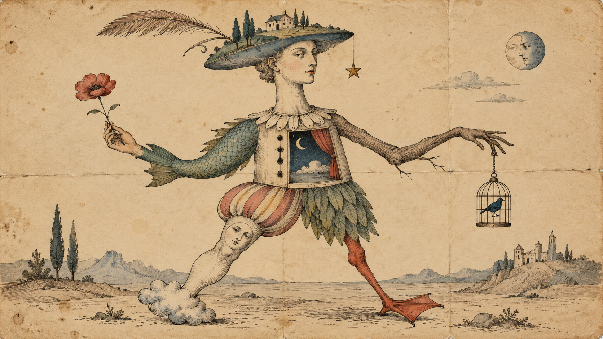

# Code Cadavre Exquis

> A sketch becomes a conversation between two people.

Cadavre exquis, or exquisite corpse, is a collaborative method associated with the Surrealists. A work is produced collectively, with each contribution responding to something that already exists while only partially knowing the intentions behind it.

Here the same idea is applied to code.

One person begins a p5.js sketch. The sketch is then passed to another person, who reads the existing code and continues it.

The sketch moves back and forth between the two people.

Nobody controls the complete outcome.

## At a glance

**Time:** 20-30 minutes  
**Format:** pairs  
**Useful for:** collaboration, code reading, interpretation, unexpected outcomes

## How it works

Work in pairs.

1. Person A starts a new p5.js sketch and works for approximately 10 minutes.
2. Pass the complete sketch to Person B.
3. Person B runs the sketch and reads the existing code.
4. Continue the system for approximately 5 minutes.
5. Pass the sketch back to Person A.
6. Continue back and forth for several rounds.
7. Look at the final sketch together.

Do not explain what you intended before passing the code.

The next person has to interpret what is already there.

> **The code itself is the communication.**

## Working remotely

Keep the exchange as simple as possible.

You can pass the sketch using:

- a p5.js editor link
- a zipped project folder
- a shared folder or file

Only one person works on the sketch at a time.

When your turn is finished, send the current version to your partner and let them continue.

## The rule

Do not erase the previous idea and replace it with your own.

**Respond to the existing system.**

You can:

- add something
- modify a relationship
- introduce a condition
- change a parameter
- extend a behaviour
- reinterpret something that already exists

Try to keep earlier decisions visible somewhere in the final system.

The aim is not to correct the previous contribution.

It is to **respond to it**.

## Keep it running

Before passing the sketch on:

- make sure it runs
- avoid leaving completely broken code
- keep the structure readable enough for someone else to enter
- do not leave instructions explaining what the next person should do

Your partner should discover the system through the code and its behaviour.

## After the final round

Run the sketch and look through the code together.

Ask:

- What did you think your partner was trying to do?
- What did you preserve?
- What did you reinterpret?
- What did you misunderstand?
- Which contribution changed the direction of the system most?
- Did an unexpected interpretation improve the work?
- Can you still identify the different contributions?
- Did the final system become something neither of you originally intended?
- At what point did the sketch stop feeling like one person's work?

## Variations

### Silent

Do not discuss the sketch until all rounds are complete.

### One rule

Each turn may introduce only one new rule.

### One change

Each turn may change only one existing part of the system.

### Short rounds

Use very short rounds and pass the sketch frequently.

### Long chain

After trying the exercise in pairs, pass one sketch through a larger group or the entire class.

### Start from the same seed

Several pairs begin with the same small piece of code.

Compare how differently the systems develop.

## What to keep

Save the final sketch.

If possible, also keep one or two intermediate versions so that the evolution of the system remains visible.

→ [Back to the Exercise Bank](./README.md)