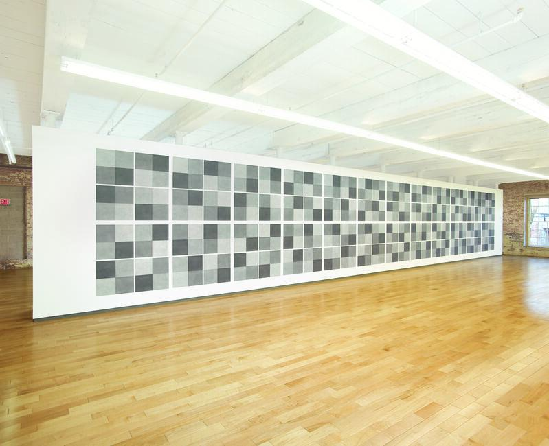
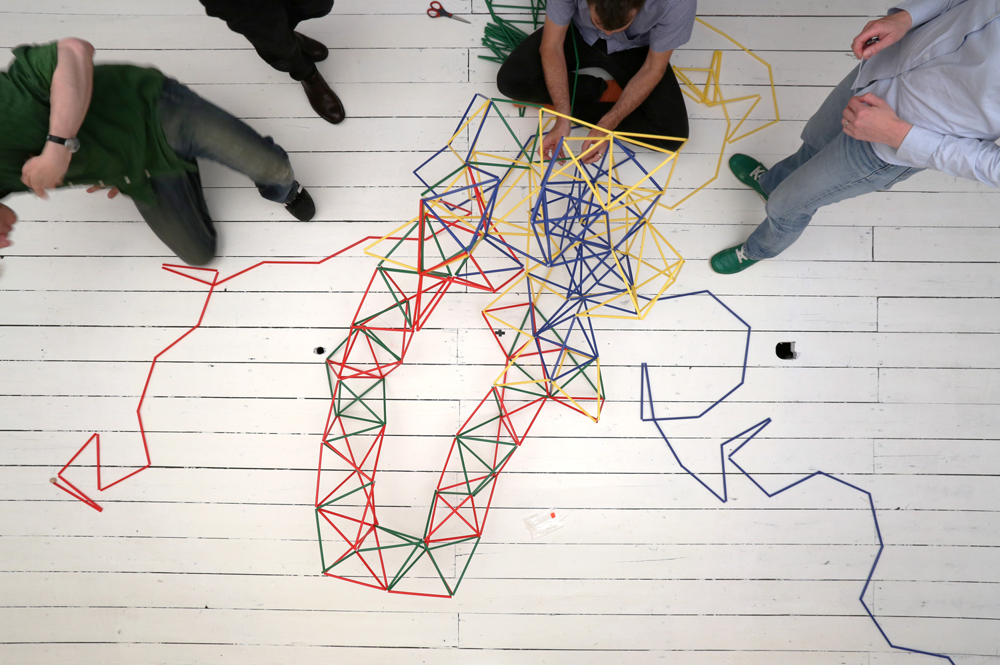
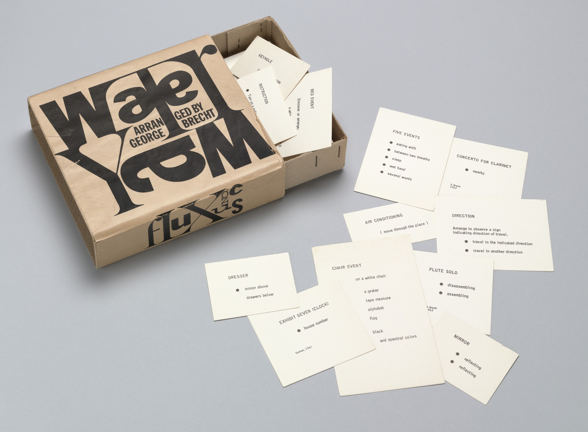
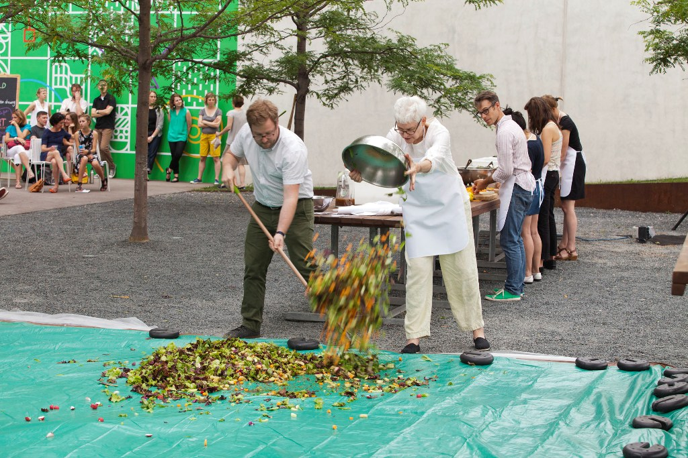
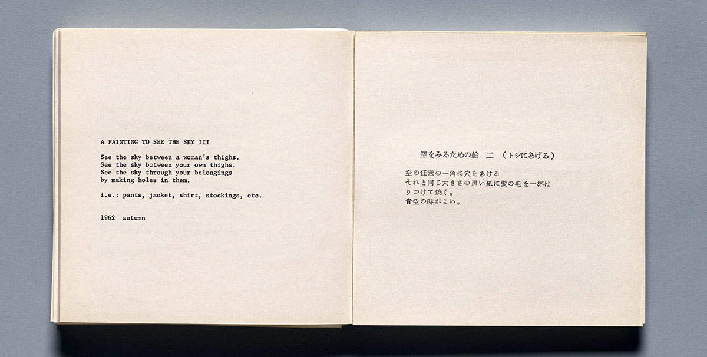

# Examples: Instructions & Rule Systems

This page collects artworks, rule systems and starting points related to Session 1. You do not need to study everything here. Use it to explore one main question:

> **What can an instruction be?**

Instructions are not simply strict or open. They can sit anywhere on a spectrum:

**specified → constrained → interpretive → poetic**

The interesting question is often where an author chooses to be precise and where they leave space for interpretation.

## Sol LeWitt: instruction as specification

Sol LeWitt's wall drawings are useful because the distinction between idea, instruction and execution becomes visible. The written instruction defines the work, while other people may execute it in different places and at different times.

A simple example is *Wall Drawing 118*:

> Fifty randomly placed points, all connected by straight lines.

Questions:

* What does "randomly" mean?
* Who chooses the points?
* How much does the instruction actually determine?
* Would two executions look identical?
* Where does authorship sit?

Try reading the instruction before looking at the resulting work.

**Explore:**

* [Sol LeWitt at MASS MoCA](https://massmoca.org/sol-lewitt/)
* [Wall Drawing 118](https://jessicacarnegie.com/sol-lewitt-wall-drawing-118)

Look at several wall drawings. Some are highly specified, while others give the drafter considerable freedom.

## Conditional Design: instruction as constraint

Conditional Design shifts the emphasis from designing a finished composition to designing the conditions under which a composition can emerge.

Participants follow rules, take turns and respond to a changing situation. Every decision alters what becomes possible next.

Questions:

* What do the rules control?
* What choices remain with the participants?
* Does the order of actions matter?
* Can an early choice make a later action impossible?
* Could the same rules produce a completely different result?

**Explore:**

* [Conditional Design book](../../assets/pdf/conditional_design_workbook.pdf)
* [Conditional Design archive](https://conditionaldesign.org/archive)
* [Conditional Design manifesto](https://conditionaldesign.org/manifesto/)

The archive contains many different systems. Browse them as examples of how a small number of constraints can create complex collective outcomes.

## George Brecht: instruction as event

George Brecht developed short written works known as **Event Scores**. Instead of describing a finished visual composition, they propose an action, event, situation or way of paying attention.

His 1963 work *Water Yam* collected these scores on individual cards inside a box.

One of the best examples to explore is *Drip Music (Drip Event)*. Its language leaves basic questions such as the source of the water, the vessel and the performer open to interpretation. Different realizations can therefore look and sound very different while still following the same score.

Questions:

* What must remain constant for two performances to be versions of the same work?
* How much does the performer contribute?
* Can an instruction define a work without defining its appearance?
* Is listening or observing already part of executing the work?

**Visual references:**

* [MoMA - Water Yam](https://www.moma.org/collection/works/126322)
* [MoMA - browse the Water Yam cards](https://www.moma.org/collection/works/portfolios/126322)
* [Getty - interactive Water Yam cards](https://www.getty.edu/publications/scores/object-index/349/)

**Read / explore:**

* [Getty - George Brecht: Drip Music](https://www.getty.edu/publications/scores/06/)
* [Getty - Drip Music score](https://www.getty.edu/publications/scores/object-index/346/)

The Getty resource is especially useful because you can browse the actual cards and compare different realizations of the same score.

## Alison Knowles: instruction as everyday action

Alison Knowles' *Proposition #2: Make a Salad* was first performed in 1962.

The basic proposition is extremely ordinary: make a salad.

Yet every realization changes according to scale, ingredients, location, participants and context. The score stays recognisable while the actual event can change dramatically.

This makes it a useful example of how a very simple instruction can generate a large family of outcomes.

Questions:

* How little information can an instruction contain and still remain recognisable?
* Which parts of the work stay constant?
* Which parts are created by the performers and situation?
* What happens when the scale changes?
* When does an ordinary action become a creative system?

**Visual reference and article:**

* [Walker Art Center - The Evolution of a Salad](https://www.walkerart.org/reader/make-a-salad-alison-knowles/)

The Walker article includes photographs of different performances and discusses how the work changed as it was performed in different contexts.

**Explore further:**

* [MoMA - Artist Instructions](https://www.moma.org/magazine/articles/407)

## Yoko Ono: instruction as imagination

Yoko Ono's *Grapefruit* collects instruction pieces that expand the idea of what a score can do.

Some instructions propose actions that could be carried out physically. Others are improbable, poetic or impossible. They may be completed partly or entirely in the participant's imagination.

Here the instruction is no longer simply a technical specification. It can direct attention, create an image in the mind, propose an experience or ask the reader to imagine an impossible action.

Questions:

* Does an instruction need to be physically executable?
* Is imagining an instruction already a form of execution?
* Where is the artwork: in the text, the action or the imagination?
* What does the participant contribute?
* What would be lost if the instruction became completely precise?

**Visual references:**

* [MoMA - Yoko Ono, Grapefruit, 1964](https://www.moma.org/collection/works/128103)

**Read / explore:**

* [Moderna Museet - Grapefruit: Idea as Art](https://www.modernamuseet.se/en/stockholm/exhibitions/yoko-ono/grapefruit-art-as-idea/)

The Moderna Museet text is particularly useful for understanding how Ono treats language, ideas, action, sound and imagination as artistic material.

## Compare the approaches

These examples expand the meaning of an instruction:

| Approach                      | Example            | What the instruction does                                     |
| ----------------------------- | ------------------ | ------------------------------------------------------------- |
| **Specify**                   | Sol LeWitt         | Describes relationships and conditions for producing a work   |
| **Constrain**                 | Conditional Design | Creates rules within which participants make decisions        |
| **Produce an event**          | George Brecht      | Proposes an action, event or situation                        |
| **Structure everyday action** | Alison Knowles     | Turns a familiar activity into a repeatable score             |
| **Activate imagination**      | Yoko Ono           | Uses language to produce ideas, images and impossible actions |

These categories are not fixed. A work may belong to several at once.

The important question remains:

> **How much should a rule determine, and how much should it leave open?**

## From one rule to a system

A common difficulty is trying to invent an entire system at once.  
Instead, begin with one action.

### Example 1: points and lines

Start:

> Place a point.

Add quantity:

> Place two points.

Add a relationship:

> Connect the two points.

Add variation:

> Place the points anywhere.

Add repetition:

> Add another point and connect it.

Add a constraint:

> A new line may not cross an existing line.

Add an ending:

> Stop when no legal move remains.

The important part is not this particular system.

The important part is the method:

**start small → test → add one rule → test again**

### Example 2: touching circles

Start:

> Draw one circle.

Add a relationship:

> Draw another circle that touches the previous circle.

Add variation:

> Choose a different size each time.

Add a constraint:

> Circles may touch but may not overlap.

Add an ending:

> Stop when another circle cannot fit on the page.

Questions:

- Who chooses the size?
- What does "touch" mean?
- What happens if there is more than one possible position?
- Should the rule specify which direction to move?

### Example 3: divide the page

Start:

> Draw one line that divides the page.

Then:

> Choose one of the resulting areas.

Then:

> Divide that area again.

Then:

> Repeat.

Possible constraints:

- always divide the largest area
- never use the same direction twice
- each new line must touch an existing line
- stop after ten divisions
- stop when every area is smaller than your hand

A small change in one rule can produce a very different family of outcomes.

### Example 4: collective system

Three people share one page.

Possible rules:

1. Each person uses a different drawing tool.
2. Take turns.
3. On your turn, add one mark.
4. Your mark must respond to the previous person's mark.
5. You may not erase.
6. After five rounds, change one rule together.
7. Continue for another five rounds.

Questions:

- Does changing the rules halfway through create a new system?
- Who is the author?
- Is discussion between participants allowed?
- What happens if the participants develop an unspoken strategy?

## Ingredients for writing a rule system

When you are stuck, choose from these ingredients.

### Starting condition

> Where does the process begin?

Examples:

- begin in the centre
- start with one point
- divide the page into four areas
- choose one corner

### Action

> What can happen?

Examples:

- place
- connect
- rotate
- divide
- move
- copy
- enlarge
- remove
- fill

### Relationship

> How does one thing relate to another?

Examples:

- touch
- align
- avoid
- follow
- overlap
- connect
- mirror
- point toward

### Repetition

> What happens again?

Examples:

- repeat five times
- repeat until the page is full
- repeat for each existing point
- repeat with a different size

### Variation

> What is allowed to change?

Examples:

- position
- size
- direction
- colour
- distance
- order

### Constraint

> What is not allowed?

Examples:

- lines cannot cross
- shapes cannot overlap
- marks must remain inside the page
- only one shape may touch the border

### Condition

> When does the behaviour change?

Examples:

- if a line reaches an edge...
- if two shapes touch...
- if there is no empty space...
- if this is the fifth repetition...

### Stopping rule

> When is the system finished?

Examples:

- after ten actions
- when no move remains possible
- when the page is full
- when the process returns to its starting point

## Questions for any generative system

When looking at an existing system or inventing your own, ask:

- What is fixed?
- What is variable?
- What happens first?
- What repeats?
- What is allowed?
- What is forbidden?
- Who makes the decisions?
- What produces variation?
- What causes the system to stop?
- Could the same rules create another valid outcome?
- What would happen if I changed only one rule?

## Explore further

- [Conditional Design archive](https://conditionaldesign.org/archive)
- [Sol LeWitt at MASS MoCA](https://massmoca.org/sol-lewitt/)
- [Yoko Ono, Grapefruit at MoMA](https://www.moma.org/learn/moma_learning/yoko-ono-grapefruit-1964/)
- [Sprouts](https://nrich.maths.org/2413)
- [p5.js Reference](https://p5js.org/reference/)

→ [Notes on these examples](./teacher-notes.md)  
→ [Back to Session 1](./README.md)  
