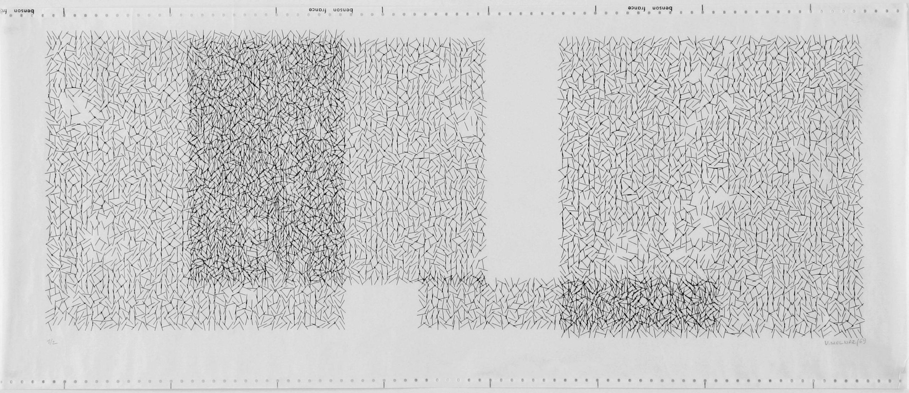
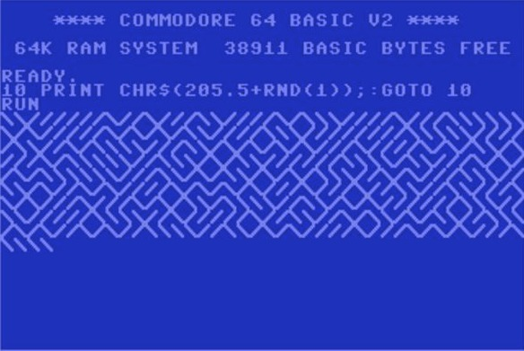
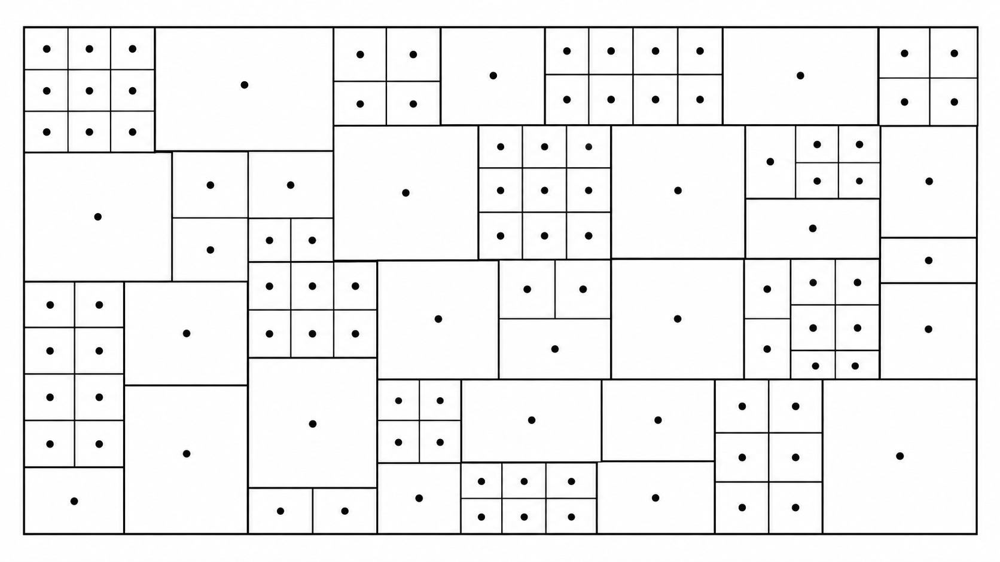

# Session 2: Examples & References

## Repetition & Variation

A generative system does not need many rules. Some of the most interesting systems begin with a very small vocabulary and repeat it many times.

While looking through these examples, ask:

- What is the basic unit?
- What repeats?
- What remains fixed?
- What is allowed to vary?
- Where does the variation come from?
- Is the variation systematic, conditional or random?
- How does a local decision affect the larger composition?


## Vera Molnár: order, variation and interruption

Vera Molnár is an important reference for thinking about repetition as something that can be **systematically disturbed**.  
Rather than treating variation as decoration added after a pattern has been created, her work often begins with a simple underlying structure and investigates what happens when that structure is gradually changed, displaced, interrupted or exposed to controlled randomness.



_Vera Molnár, Interruptions à recouvrements, 1969. Computer-generated plotter drawing._

In the _Interruptions_ series, Molnár begins with a grid of straight lines, introduces random rotation, and then removes sections to create voids or "interruptions". The regular structure remains visible underneath the disturbance.

### Look for

- repetition of a very small visual element
- density created through accumulation
- empty space as an active part of the system
- small deviations inside a larger structure
- order that remains visible even when it is disturbed

### Try this

Begin with a completely regular grid or field.
Then disturb only one property:

- angle
- position
- spacing
- size
- density
- probability of appearing

Do not change everything at once.

> **How much disorder can you introduce before the original system disappears?**

### References

- [Vera Molnár at the Digital Art Museum](https://dam.org/museum/artists_ui/artists/molnar-vera/)
- [Interruptions, 1968-1969](https://dam.org/museum/artists_ui/artists/molnar-vera/interruptions/)
- [Early plotter drawings, 1968](https://dam.org/museum/artists_ui/artists/molnar-vera/early-plotter-drawings/)
- [Interruptions à recouvrements on Wikimedia Commons](https://commons.wikimedia.org/wiki/File:Vera_Molnar._Interruptions_%C3%A0_recouvrements%E2%80%9D_from_1969.jpg)

## Truchet tiles: one unit, many structures

Truchet tiles are a particularly clear example of how **a very small set of local possibilities can create many global patterns**.
Start with one square tile containing a simple graphic rule. The tile is repeated across a grid, but its orientation can change.


_Truchet tiling. A repeated tile changes orientation to produce a larger pattern._

The individual unit can be extremely simple. Complexity emerges through its relationship with neighbouring tiles.

A minimal version might have only two possible states:

```text
┌─────┐   ┌─────┐
│╲    │   │    ╱│
│ ╲   │   │   ╱ │
│  ╲  │   │  ╱  │
│   ╲ │   │ ╱   │
│    ╲│   │╱    │
└─────┘   └─────┘
 state A    state B
```

Each cell chooses between the two orientations.

The important idea is not the particular shape of the tile.
It is the relationship:

**same unit + limited states + repetition = many possible compositions**

Another common Truchet variation uses pairs of quarter-circle arcs. Rotating the tile creates connections between neighbouring cells and can produce long continuous paths across the grid.

### Questions

- How many different states can one tile have?
- Does each tile make an independent decision?
- Does the tile need to know anything about its neighbours?
- Can a large continuous form emerge even if each cell only follows a local rule?
- What changes if you use two states instead of four?
- What happens if the probabilities are unequal?

### Try this

Design your own tile using only:

- two lines
- two arcs
- one circle and one line
- two filled areas

Give the tile two or four possible states.
Repeat it across a grid and explore different arrangements.

### References

- [Truchet tiles overview](https://en.wikipedia.org/wiki/Truchet_tiling)
- [Truchet Tiles at drMathArt](http://drmathart.com/Resources/Truchet/)
- [Public-domain Truchet tiling examples on Wikimedia Commons](https://commons.wikimedia.org/wiki/Category:Truchet_tiles)

## From Truchet tiles to 10 PRINT

Truchet tilings and **10 PRINT** are closely related.
Both use a small number of possible local states repeated across a larger field.

With 10 PRINT the visual vocabulary is almost absurdly small:

```text
\    /
```

At each position, choose one of the two marks.
Then move to the next position and repeat.

That is enough to produce a maze-like structure.



The original Commodore 64 BASIC program is one line:

```bash
10 PRINT CHR$(205.5+RND(1)); : GOTO 10
```

The program combines:

- repetition
- two possible states
- random selection
- a regular spatial structure

The result is unpredictable in detail while remaining immediately recognizable as the same system.

## 10 PRINT: local decisions, global form

The book _10 PRINT CHR$(205.5+RND(1)); : GOTO 10_ takes this single line of code as a starting point for examining creative computation, randomness, regularity, programming culture and the history of the Commodore 64.

The interesting question for us is not simply:

> How do I reproduce this pattern?

Instead ask:

> **What is the smallest change I can make to create a different system?**

### Change one thing

Try changing only one parameter at a time.

**Probability**

```js
if (random() < 0.8) {
  // state A
} else {
  // state B
}
```

**Number of states**
Instead of two possible lines, create three or four possible marks.

**Scale**
Change the size of each cell.

**Direction**
Build vertically, diagonally or from the centre outward.

**Visual unit**
Replace the diagonal lines with:

- arcs
- circles
- triangles
- short lines
- small custom shapes

**Rule**
Instead of choosing completely randomly, make the decision depend on:

- row
- column
- previous state
- distance from the centre
- mouse position

Each change produces a different relationship between **structure and variation**.

### References

- [10 PRINT](https://10print.org/)
- [Download the 10 PRINT book](https://10print.org/10_PRINT_121114.pdf)
- [10 PRINT with p5.js, The Coding Train](https://thecodingtrain.com/challenges/76-10print/)

## Generative Design: grids as systems

The book _Generative Design: Creative Coding for the Web with JavaScript in p5.js_ by Benedikt Groß, Hartmut Bohnacker, Julia Laub and Claudius Lazzeroni is one of the main practical references for this course.
It approaches programming from a visual design perspective and provides a large collection of clearly structured examples together with the complete source code. The code is openly available and can be modified, compared and reused as a starting point for experiments. ([GitHub][2])

For this session, the **P.2.1 Grid** examples are especially relevant. They explore how a regular grid can become a generative system through changes in:

- spacing
- module size
- alignment
- rotation
- compound shapes
- mouse input
- relationships between neighbouring elements



_Selected grid and module studies from Generative Design._

When looking at the examples, do not only look at the final image. Open the code and identify:

- the loop that creates the grid
- how `x` and `y` positions are calculated
- which values remain fixed
- which values depend on position or input
- where variation enters the system

A useful exercise is to take one example and change **one relationship rather than the whole program**.

For example:

> Keep the grid and loop structure, but replace the visual module.

Or:

> Keep the module, but change how its size or rotation responds to position.

This is often a better way to learn from existing code than copying the complete visual result.

### References

- [Generative Gestaltung / Generative Design](http://www.generative-gestaltung.de/)
- [Generative Design p5.js code package](https://github.com/generative-design/Code-Package-p5.js)
- [Generative Design on onformative](https://onformative.com/work/book-generative-gestaltung/)

## Four ways to create variation

When building your own systems, it can help to distinguish different sources of variation.

### 1. Systematic variation

A value changes according to a predictable rule.

```text
small → medium → large
```

For example:

- size increases from left to right
- rotation increases by 10° each step
- spacing gradually becomes wider

### 2. Alternation

Two or more states repeat in sequence.

```text
A B A B A B A B
```

Or:

```text
A A B A A B A A B
```

### 3. Conditional variation

A rule changes when a condition becomes true.

```text
if column is even → draw a circle
else → draw a line
```

This is useful for introducing exceptions without losing the overall structure.

### 4. Probabilistic variation

A decision is made according to probability.

```text
70% → state A
30% → state B
```

Randomness does not mean that everything must be equally likely.

## Repetition, variation, exception

A useful way to develop a system is:

**repeat → vary → interrupt**

Start with something regular.

```text
○ ○ ○ ○ ○ ○ ○ ○
```

Introduce systematic variation.

```text
○ ◯ ◯ ◯ ◉ ◉ ◉ ◉
```

Introduce an exception.

```text
○ ○ ○ ○ ● ○ ○ ○
```

Introduce controlled randomness.

```text
○ ● ○ ○ ● ○ ● ○
```

These can produce very different visual experiences even though the underlying structure remains almost identical.

## Things to investigate

When you find an interesting pattern or generative artwork, try to reverse-engineer it before looking for code.

Ask:

1. What is the smallest repeated element?
2. How is the space organised?
3. Which properties remain constant?
4. Which properties vary?
5. Is the variation continuous or discrete?
6. Is it deterministic or probabilistic?
7. Are there exceptions?
8. When does the system stop?
9. Could the same rules produce a very different result?
10. What would happen if you changed only one rule?

The goal is not to copy the appearance of an example.
The goal is to understand the **system that could produce it**.

→ [Notes on this session](./teacher-notes.md)  
→ [Back to Session 2](./README.md)
