# Session 3: Clock(s)

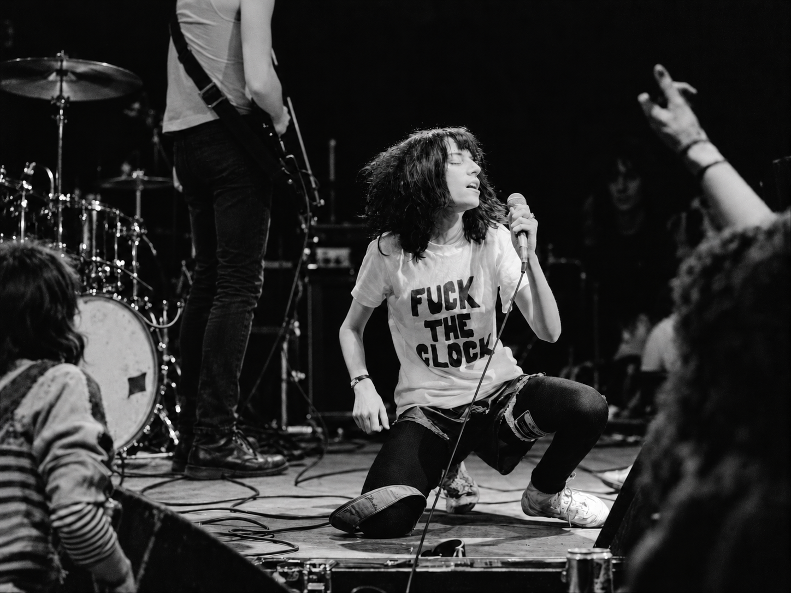

[_Allan Tannenbaum, Patti Smith (Fuck the Clock), 1978 x AI_](https://www.modernrocksgallery.com/bands-n-s/patti-smith-fuck-clock-tannenbaum)

Singer-songwriter Patti Smith wore her declarative T-shirt during a New Year's Eve performance at CBGB in New York City in 1978. The phrase can be read as a rejection of modern life organised around schedules, deadlines and measured time.

A clock is never only a device for displaying hours and minutes. It also reflects how we choose to divide, represent and experience time.

## Focus

Represent **time, duration, cycles and change** visually and conceptually through a generative system.

## Idea

A device or system that visualises the passing of time.

It changes throughout the day and incorporate some form of **cycle, rhythm, repetition or accumulation**.

### Consider different ways of understanding time:

- biological time and chronobiology
- ultradian, circadian and infradian rhythms
- solar and lunar cycles
- celestial time
- geological time
- historical time
- decimal time
- psychological time
- subjective time
- duration
- repetition
- anticipation
- memory

### Ask:

- What aspect of time does the system represent?
- What changes continuously?
- What happens periodically?
- What accumulates?
- What resets?
- Does the system show exact time or an experience of time?
- What would the system look like at another moment of the day?

## The concept of time

Time and movement in art are closely connected, but they are not the same thing.

Movement can be directly observed. Time is more abstract. It can be measured through changes, cycles, events, memories and relationships.

A time-based work may therefore make time visible indirectly:

**change → duration → repetition → accumulation → memory**

## Linear and cyclical time

### Linear time

In a linear model, time moves from a past toward a future.

```text
past → present → future
```

The present continually moves forward.

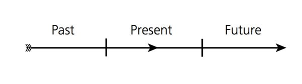

[_American flow of time, Richard Lewis_](https://www.businessinsider.com/how-different-cultures-understand-time-2014-5)

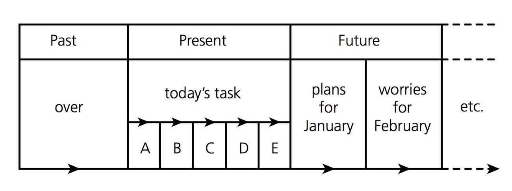

[_Carving up American time, Richard Lewis_](https://www.businessinsider.com/how-different-cultures-understand-time-2014-5)

Digital clocks, calendars, schedules and timelines are strongly associated with this model because they divide time into measurable units.

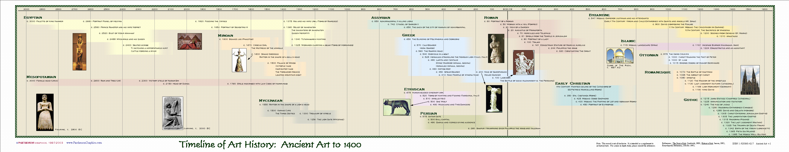

[_Timeline of art in the ancient world, Parthenon Graphics_](http://chaos1.hypermart.net/fullsize/artancfs.gif)

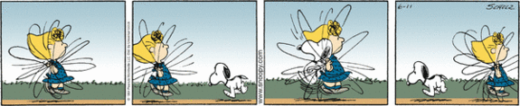

_Charles M. Schulz, Peanuts._

### Cyclical time

In contrast, cyclical time describes repeating processes.

```text
cycle → return → cycle → return → ...
```

Examples include:

- day and night
- seasons
- lunar phases
- biological rhythms
- breathing
- rotation
- mechanical clocks

Analog clocks are themselves visualisations of cyclical time.

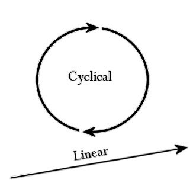

Cycles can also exist inside other cycles.

- A second belongs to a minute.
- A minute belongs to an hour.
- An hour belongs to a day.
- Days belong to larger biological, social and astronomical cycles.

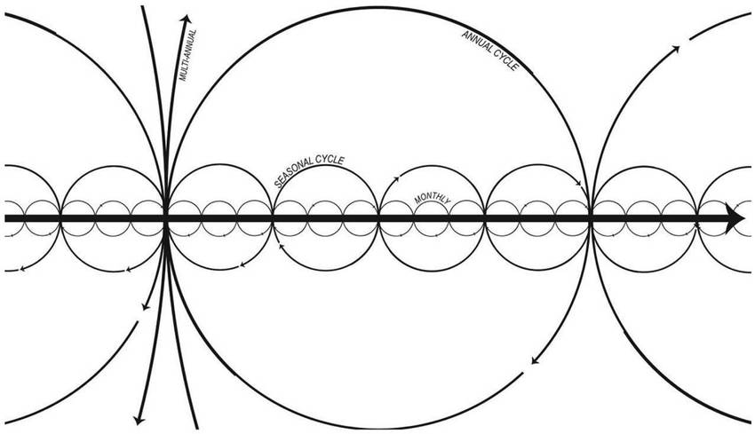

[_Portrayal of historical experience combining linear and cyclical modes_](https://www.researchgate.net/figure/Portrayal-of-historical-experience-that-encompasses-both-linear-and-cyclical-modes-as_fig6_318292472)

The distinction between linear and cyclical time is useful, but most real systems contain elements of both.

## References

### Humans since 1982: ClockClock

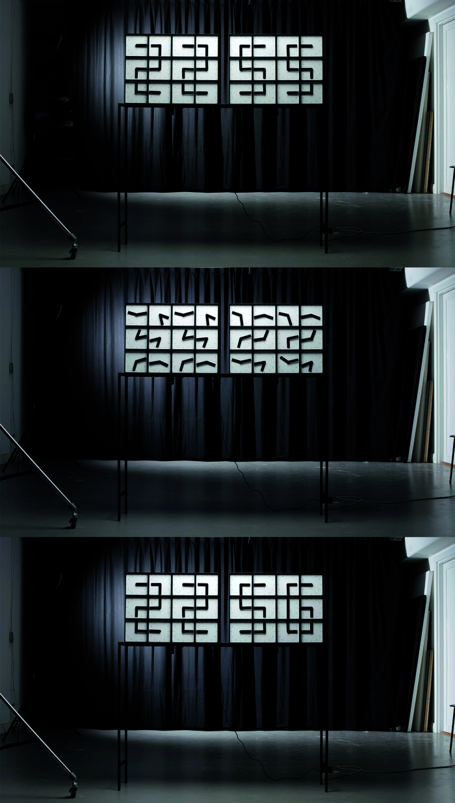

_ClockClock, Humans since 1982._

ClockClock uses many analogue clock faces as individual visual units. Their hands rotate independently and periodically align to create larger figures.

The work turns a familiar timekeeping mechanism into a generative display.

It is useful to think about:

- one unit versus the larger composition
- synchronisation
- independent cycles
- phase
- temporary alignment
- readability emerging from motion

See also [A Million Times](https://www.humanssince1982.com/a-million-times-san-jose-2021).

<iframe src="https://player.vimeo.com/video/52798481?h=ba2c0cd8e2&color=ffffff" width="100%" style="aspect-ratio: 16 / 9" frameborder="0" allow="autoplay; fullscreen; picture-in-picture" allowfullscreen></iframe>

[Watch _ClockClock White_ by Humans since 1982 on Vimeo](https://vimeo.com/52798481)

### Christiaan Postma: Clock

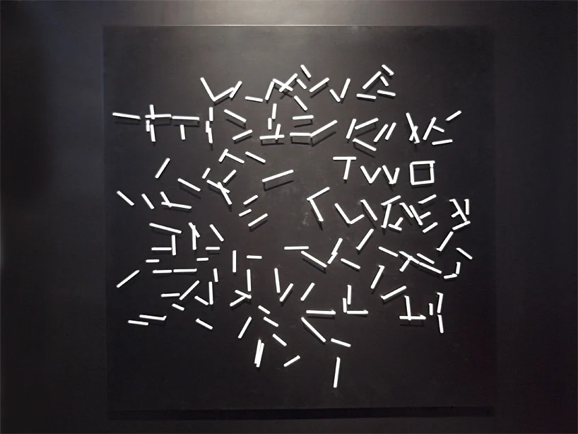

[_Clock by Christiaan Postma, image via Designboom_](https://www.designboom.com/design/oclock-time-design-design-time-at-triennale-design-museum-milan/)

Christiaan Postma's _Clock_ uses more than 150 individual clock mechanisms arranged to function together as one larger clock.

The hands gradually form written hour names. The current hour becomes readable as its word becomes complete while the surrounding words dissolve.

The work uses the clock mechanism itself as both **data source and drawing instrument**.

### Albin Karlsson: 0.5g min

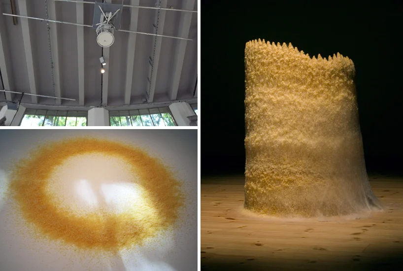

[_0.5g min, Albin Karlsson, 2007. Image via Designboom_](https://www.designboom.com/design/oclock-time-design-design-time-at-triennale-design-museum-milan/)

In _0.5g min_, a machine releases approximately 0.5 grams of hot glue every minute while rotating like the hand of an analogue clock.

Rather than displaying time symbolically, the machine **converts duration into physical material**.

A form gradually grows on the floor.

Time becomes accumulation.

<iframe src="https://player.vimeo.com/video/606592643?h=295f4680bd&title=0&byline=0" width="100%" style="aspect-ration 16 / 9" frameborder="0" allow="autoplay; fullscreen; picture-in-picture" allowfullscreen></iframe>

[Watch the video by Albin Karlsson on Vimeo](https://vimeo.com/606592643)

See also: [Countdown](https://www.albinkarlsson.com/countdown/)

### Exquisite Clock

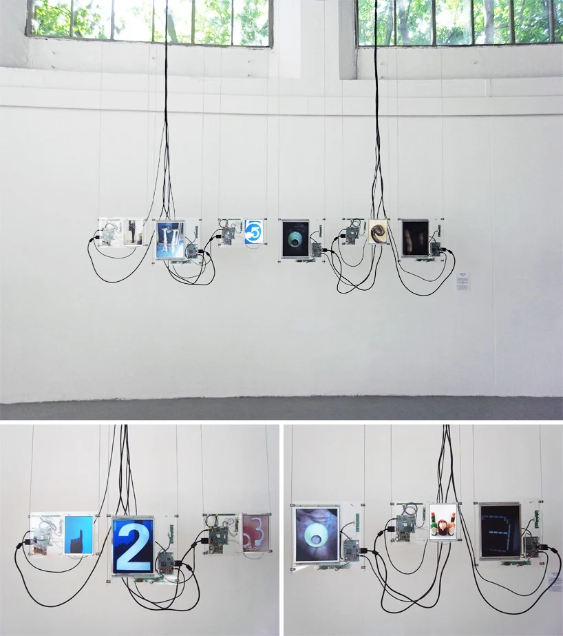

[_Exquisite Clock_](https://jhwilbert.com/portfolio/exquisite-clock/)

_Exquisite Clock_ builds a digital clock from photographs contributed by different people.

Each digit is replaced by an image containing that number in the physical world.

The clock therefore combines exact digital time with a continuously changing collective image archive.

### Olafur Eliasson: Beyond Human Time

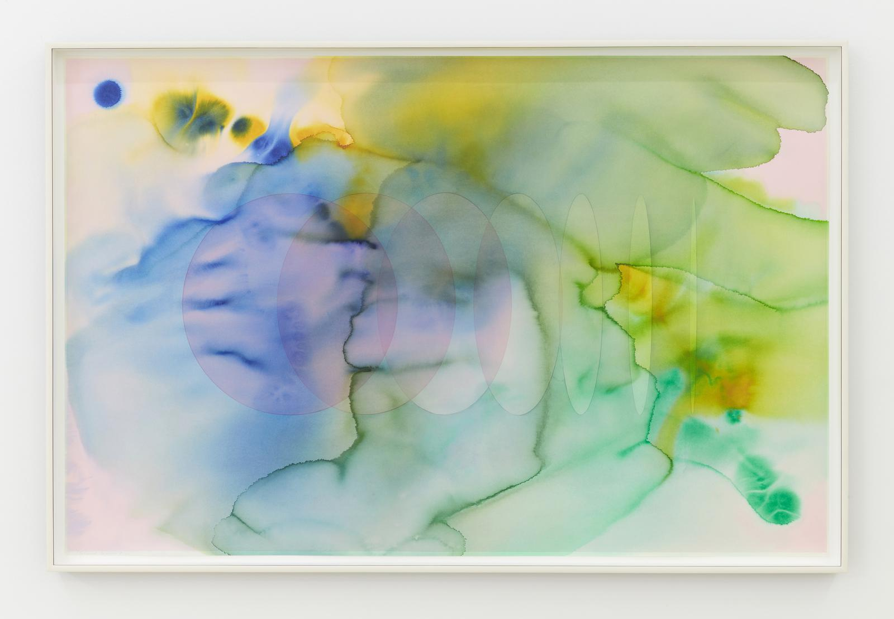

[_Olafur Eliasson, Beyond Human Time, 2020_](https://olafureliasson.net/archive/artwork/WEK110938/beyond-human-time)

_Beyond Human Time_ was produced using pieces of ancient glacial ice collected during the production of _Ice Watch_.

The work connects human perception of time with geological and environmental timescales.

Rather than measuring seconds or hours, it asks us to think about forms of duration far beyond everyday human experience.

### Olafur Eliasson: Solar Noon

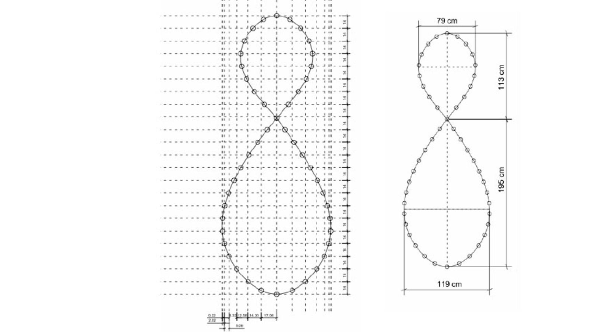

[_Olafur Eliasson, Solar Noon_](https://olafureliasson.net/archive/artwork/WEK100480/solar-noon)

Here time is connected to the movement of the sun rather than to an arbitrary digital counter.

This is a useful reminder that clocks are abstractions built on top of larger physical and astronomical cycles.

### Susanna Hertrich: Chrono-Shredder

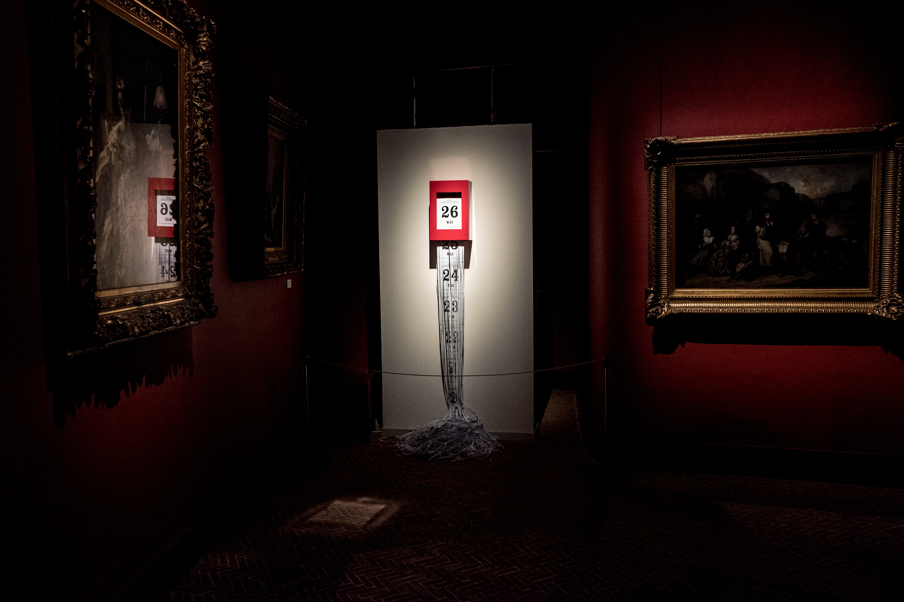

[_Chrono-Shredder, Susanna Hertrich_](http://www.susannahertrich.com/work/chrono-shredder-i-iv/)

_Chrono-Shredder_ prints the current date on a continuous roll of paper.

As time passes, the printed dates slowly move toward a shredder and are destroyed.

The work connects measurement, anticipation and irreversible time.

It does not only display time.

It physically removes the past.

### Martí Guixé: Time to Eat

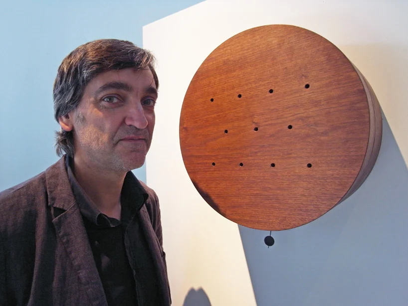

[_Time to Eat by Martí Guixé, image via Designboom_](https://www.designboom.com/design/oclock-time-design-design-time-at-triennale-design-museum-milan/)

_Time to Eat_ communicates different moments of the day through smell.

Instead of showing a number, the clock releases scents associated with activities such as breakfast, cooking vegetables or preparing tomato sauce.

The interesting question is:

> **What other senses could be used to represent time?**

### Martí Guixé: Time For

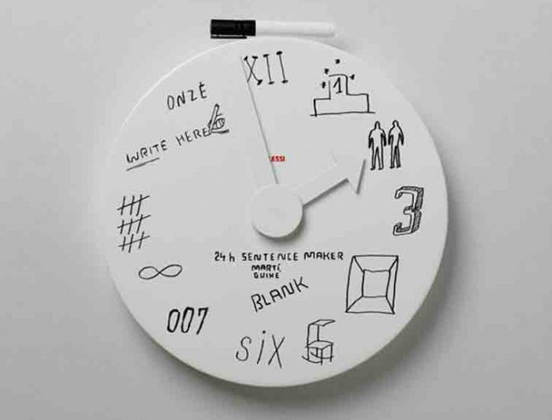

[_Time for Guixé, Milan 2010_](https://www.designindaba.com/articles/creative-work/time-guix%C3%A9-milan-2010)

This project questions what information a clock actually needs to provide and how conventional clock interfaces shape our experience of time.

### Thorunn Arnadottir: Sasa Clock

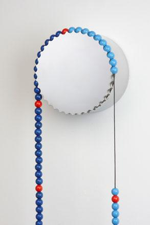

_Thorunn Arnadottir, Sasa Clock._

The _Sasa Clock_ consists of painted wooden beads suspended over a slowly rotating carousel.

A bead slips down the cord every five minutes.

Time becomes a sequence of physical events rather than a continuously moving hand or changing number.

## More clock references

Golan Levin's lecture on representing time collects many historical, artistic and experimental examples:

[Representing Time, Golan Levin](https://github.com/golanlevin/lectures/tree/master/lecture_clock)

When browsing the examples, do not focus only on appearance.

Ask:

- What source of time does the work use?
- What is cyclical?
- What accumulates?
- What disappears?
- What repeats?
- What is measured?
- What is deliberately not measured?
- Is the current time readable?
- Does it matter if it is not?
- What relationship to time does the work propose?

## p5.js example

A simple p5.js clock can begin by reading:

```js
hour();
minute();
second();
```

and mapping these values to visual properties.

<iframe src="https://preview.p5js.org/guma/embed/yZYaRwKAz" width="100%" height="400" frameborder="0"></iframe>

[_Simple Clock in p5.js_](https://editor.p5js.org/guma/sketches/yZYaRwKAz)

Do not treat this example as a visual model to reproduce.

Instead identify:

- where time enters the program
- how values are mapped
- which properties change
- which cycles repeat
- what could be replaced with another visual relationship

## Resources

- John Cage and time-based works
- p5.js reference: `hour()`, `minute()`, `second()` and `millis()`
- [Coding Challenge: Clock](https://www.youtube.com/watch?v=E4RyStef-gY)
- [Time as a spiral](https://forge.medium.com/theories-of-time-95783b12323a)
- [Perspectives on linear and cyclical time](https://www.theperspective.com/debates/living/perspective-time-linear-cyclical/)
- [International Atomic Time](https://www.timeanddate.com/time/international-atomic-time.html)

→ [Back to Session 3](./README.md)  
→ [Examples and references](./examples.md)