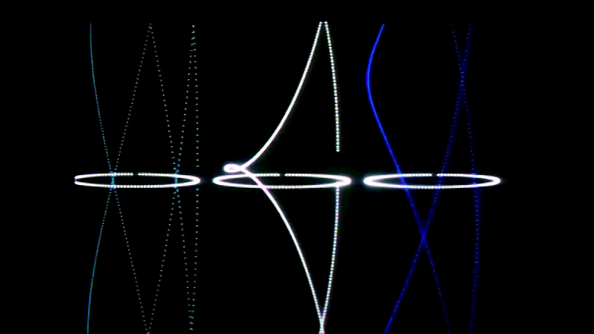
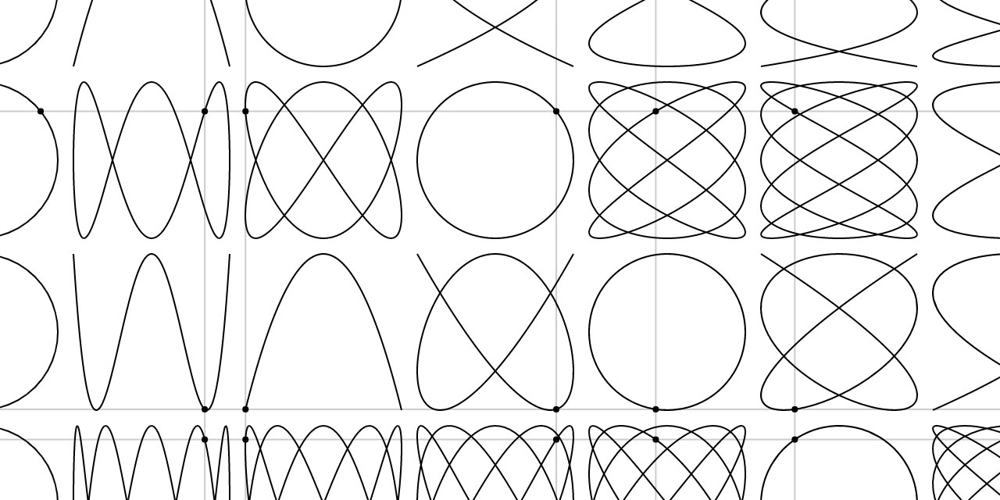
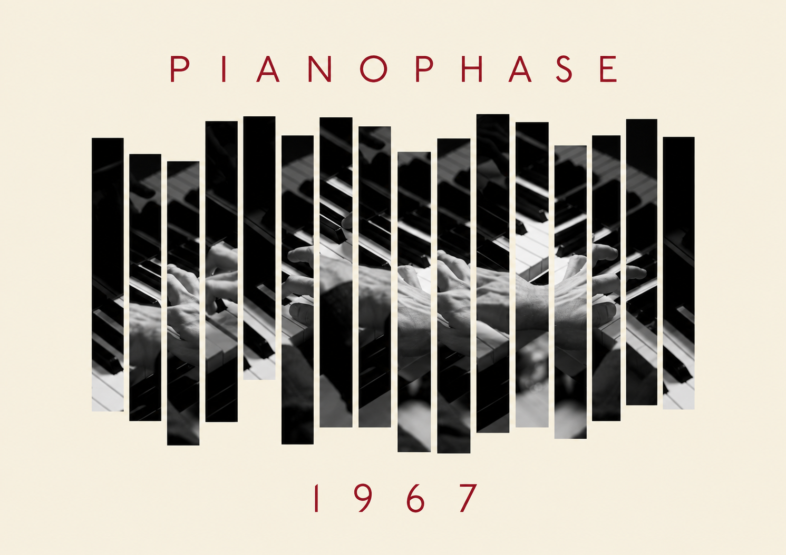
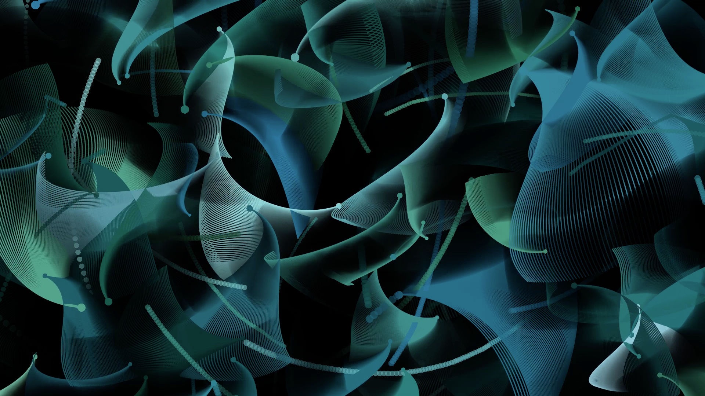
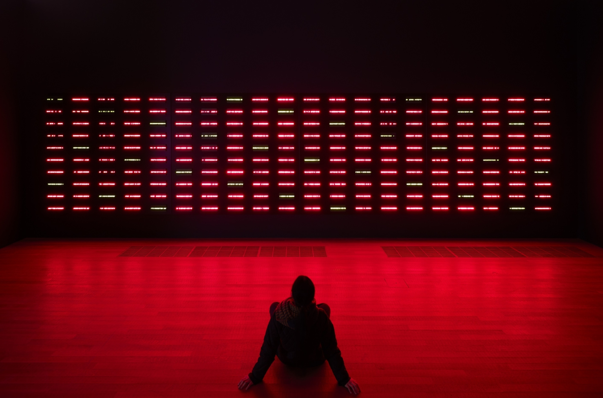

# Session 3: Examples & References

## Change Over Time

A generative system does not need to remain still. Values can change, repeat, drift, accumulate, synchronise or respond to time.

While looking through these examples, ask:

- What changes?
- What remains constant?
- What causes the change?
- Is the change continuous or event-based?
- Does the system repeat?
- Does it remember what happened before?
- Are several rhythms happening at once?
- Does the system use its own internal time or real-world time?

## John Whitney: motion as a system



[_John Whitney, Arabesque, 1975. Computer-generated film._](https://www.youtube.com/watch?v=sQrq7S0dP54)

John Whitney was one of the pioneers of computer-generated moving images. His films use relatively simple geometric elements, mathematical relationships, repetition and carefully controlled motion to create complex visual compositions.

In works such as _Catalog_, _Permutations_ and _Arabesque_, motion is not something added after the image has been designed. Movement, rhythm and transformation are part of the system itself.

In _Arabesque_, geometric points and forms follow mathematical relationships that continuously transform over time.

### Look for

- repeated geometric elements
- rotation and circular motion
- changes in scale
- symmetry
- several simultaneous movements
- relationships between visual rhythm and musical rhythm
- complex forms emerging from simple mathematical relationships

### Questions

- What is actually moving?
- Which movements appear cyclical?
- Do different elements move at the same speed?
- Could the same system produce a still image?
- What would be lost if the movement stopped?

### Try this

Begin with one point or circle moving in a cycle.

Then add another element using:

- a different speed
- a different radius
- a different phase
- the opposite direction

Do not design the final shape directly.

Let the relationship between the movements create the composition.

### Video



### References

- [Whitney Museum of American Art - Histories of the Digital Now](https://whitney.org/essays/histories-of-the-digital-now)
- [ACMI - John Whitney, Arabesque, 1975](https://www.acmi.net.au/works/114089--arabesque/)
- [Academy Film Archive - Whitney Collection](https://www.oscars.org/film-archive/collections/whitney-collection)

## Cycles and oscillation

Many forms of change do not continue indefinitely in one direction.

They return.

Examples include:

- rotation
- pendulums
- waves
- breathing
- blinking
- vibration
- day and night
- seasons

A useful mathematical tool for describing cyclical change is the sine wave.

```text
      ╭───╮       ╭───╮
     ╱     ╲     ╱     ╲
────╯       ╰───╯       ╰────
```

A sine value repeatedly moves between two extremes.

In code, that repeating value can control:

- position
- size
- rotation
- colour
- opacity
- spacing

The important idea is:

**a cycle converts the passage of time into a repeating value**

### Code example

<iframe src="https://codepen.io/gu-ma/full/poryRGb" width="100%" height="450" frameborder="0"></iframe>

## Lissajous figures: several cycles at once



_Lissajous figures produced by combining oscillations with different frequencies and phases._

A Lissajous curve is produced when one oscillating value controls the horizontal position while another controls the vertical position.

For example:

```js
let x = sin(t);
let y = sin(t * 2);
```

Even though both movements are individually simple, their relationship can produce a much more complex trajectory.

Changing only the ratio between the two frequencies produces a different family of forms.

### Look for

- two simultaneous cycles
- frequency
- phase
- repetition
- symmetry
- moments when the trajectory returns to its starting point

### Try this

Create a point whose position is controlled by two cycles:

```js
let x = width / 2 + sin(t) * 150;
let y = height / 2 + sin(t * 2) * 150;
```

Then change only the relationship between the frequencies.

Try:

```text
1 : 1
1 : 2
2 : 3
3 : 4
```

What changes when the cycles are almost, but not quite, synchronised?

### References

- [Wikimedia Commons - Lissajous curves](https://commons.wikimedia.org/wiki/Category:Lissajous_curves)
- [p5.js reference - `sin()`](https://p5js.org/reference/p5/sin/)
- [p5.js reference - `cos()`](https://p5js.org/reference/p5/cos/)

## Steve Reich: rhythm and phase



[_Basic repeating pattern from Steve Reich's Piano Phase._](https://www.youtube.com/watch?v=wNVzDGnkbDI)

Steve Reich's _Piano Phase_ (1967) begins with two performers repeating the same short musical pattern.

At first they play together.

One performer then gradually increases speed while the other maintains the original tempo. The two patterns slowly move out of alignment.

Eventually they meet again.

The musical material remains extremely limited, but the relationship between the two repetitions continually changes.

This process is known as **phasing**.

### Look for

- repetition
- two almost identical systems
- slightly different speeds
- synchronisation
- desynchronisation
- patterns that emerge from interference
- eventual return

The important idea is:

> **Complexity can come from the relationship between cycles rather than from adding more material.**

### Questions

- What happens when two identical systems run at slightly different speeds?
- At what moment do they appear most different?
- When do they align again?
- Is either performer controlling the resulting patterns directly?
- Where does the complexity come from?

### Try this

Create two oscillating elements.

Give them almost the same speed:

```js
let a = sin(frameCount * 0.05);
let b = sin(frameCount * 0.052);
```

Watch how their relationship changes over time.

You could map the two values to:

- position
- rotation
- size
- colour
- sound
- two different groups of elements

## Video



### References

- [Steve Reich - Piano Phase](https://stevereich.com/composition/piano-phase/)
- [Alexander Chen - Piano Phase visualisation](https://www.chenalexander.com/Piano-Phase)
- [Wikimedia Commons - Piano Phase pattern](https://commons.wikimedia.org/wiki/File:Piano_phase_pattern1.png)
- [Wikimedia Commons - Phasing in music](<https://commons.wikimedia.org/wiki/Category:Phasing_(music)>)

## Accumulation: the past remains visible

Not every frame needs to erase what came before.

If the background is not cleared, the previous state remains visible and the image can accumulate over time.

This produces a very different relationship with time.

Instead of:

```text
new frame replaces old frame
```

we get:

```text
new frame + previous frames = accumulated image
```

A movement can therefore become a drawing.

A behaviour can leave a trace.

Time becomes visible through what remains.

## LIA: code, motion and traces



[_LIA, flow, 2006. Generative audiovisual work._](https://www.liaworks.com/archive/further-a-generative-audiovisual-work/)

LIA's practice has explored software, code, motion and generative systems since the 1990s.

In _flow_, small graphic elements multiply repeatedly. The impression of movement comes largely from their continuous proliferation and accumulation rather than from conventional animated objects travelling across the screen.

Other works use motion, traces, transformation and repeated behaviour to build images gradually over time.

This is useful because it shifts the question from:

> Where is the object moving?

to:

> **What image is being produced by the history of the system?**

### Look for

- accumulation
- repetition
- traces of previous actions
- density changing over time
- simple elements producing complex structures
- emergence through repeated behaviour

### Questions

- What would a single frame look like?
- What information about the past remains visible?
- Does the image have a final state?
- What determines when the composition becomes dense?
- Is movement happening in the objects or in the changing image?

### Try this

Create a moving point or line without clearing the background every frame.

Compare:

```js
function draw() {
  background(255);
  // draw
}
```

with:

```js
function draw() {
  // draw without clearing
}
```

Then experiment with partially transparent backgrounds.

How much history should remain visible?

### References

- [LIA - official website](https://www.liaworks.com/)
- [LIA - flow](https://www.liaworks.com/archive/flow-a-generative-audiovisual-work/)
- [LIA - The Four Seasons](https://www.liaworks.com/videos/the-four-seasons-a-generative-series/)
- [LIA - Transition 89](https://www.liaworks.com/videos/transition-89-a-generative-audiovisual-work/)

## Tatsuo Miyajima: many simultaneous times



_Tatsuo Miyajima, Keep Changing, Connect with Everything, Continue Forever, 1998._

Tatsuo Miyajima frequently works with electronic counters that cycle through numbers.

In _Keep Changing, Connect with Everything, Continue Forever_, hundreds of LED counters move through numerical cycles at different speeds.

The counters do not all share one universal rhythm.

Each one has its own tempo.

Some are also connected so that the completion of one counting cycle can trigger another.

The result is not one clock but a field of many simultaneous temporal systems.

### Look for

- repeated cycles
- different speeds
- individual and collective rhythms
- asynchronous behaviour
- moments of darkness
- connections between separate systems

### Questions

- What happens when every element has its own speed?
- Is there one global time in the work?
- Can individual cycles still form a larger composition?
- What happens when one system triggers another?
- When does repetition begin to feel like behaviour?

The last question is particularly important because it points toward the next session.

### Try this

Create several elements with different temporal intervals.

For example:

```text
A → changes every 30 frames
B → changes every 45 frames
C → changes every 70 frames
```

Watch when their changes coincide.

Then try making one event trigger another.

### References

- [Museum of Contemporary Art Tokyo - Tatsuo Miyajima, Keep Changing, Connect with Everything, Continue Forever](https://museumcollection.tokyo/en/works/6383333/)

## Time as input

So far, most examples have created their own internal time.

A program can also respond to time outside itself.

For example:

```js
second();
minute();
hour();
```

The current time can become another source of data.

This creates a different kind of system:

```text
real-world time → rule → visual behaviour
```

Examples:

```text
seconds → rotation
minutes → number of elements
hours → colour
```

But a system connected to real-world time does not need to look like a conventional clock.

It might communicate:

- duration
- waiting
- passing time
- accumulation
- cycles
- day and night
- approximate time
- several different scales of time

→ [Clock and timepiece references](./clock.md)

## Five ways to change over time

When building a temporal system, it can help to distinguish different kinds of change.

### 1. Linear change

A value continually increases or decreases.

```text
0 → 1 → 2 → 3 → 4 → 5
```

For example:

- move across the screen
- grow continuously
- rotate continuously

### 2. Cyclical change

A value returns repeatedly.

```text
0 → 1 → 0 → -1 → 0 → 1
```

For example:

- oscillation
- rotation
- breathing
- pulsing

### 3. Event-based change

Something happens at an interval or when a condition becomes true.

```text
wait → event → wait → event
```

For example:

- change every 60 frames
- reset after reaching an edge
- create a new object every second

### 4. Stateful change

The next state depends on the current state.

```text
current state → rule → next state
```

For example:

- position changes according to velocity
- a counter remembers its previous value
- one event changes what can happen next

### 5. Time-driven change

An external source of time controls the system.

```text
current time → visual parameter
```

For example:

- `second()` controls rotation
- `minute()` controls density
- `hour()` changes the overall composition

These approaches can also be combined.

## From space to time

Session 2 explored repetition across space:

```text
● ● ● ● ● ●
```

Session 3 explores repetition across time:

```text
state 1 → state 2 → state 3 → state 4
```

Many of the same questions still apply:

- What repeats?
- What varies?
- What remains constant?
- What introduces difference?
- When does the system reset?
- What happens when several repetitions interact?

The important shift is that the output is no longer a single fixed composition.

The **history of the system becomes part of the work**.

## Things to investigate

When looking at a moving or time-based generative work, try to identify the system behind it.

Ask:

1. What changes from one moment to the next?
2. What remains constant?
3. What controls the speed of change?
4. Is the change linear, cyclical or event-based?
5. Does the system remember previous states?
6. Does anything accumulate?
7. Are several cycles happening simultaneously?
8. Are those cycles synchronised?
9. Does the system ever return to exactly the same state?
10. Is it using internal time or real-world time?
11. Could the system continue forever?
12. What would remain if the animation stopped?

The goal is not simply to make something move.

The goal is to understand **how time is structured inside the system**.

→ [Clock and timepiece references](./clock.md)  
→ [Notes on this session](./teacher-notes.md)  
→ [Back to Session 3](./README.md)
