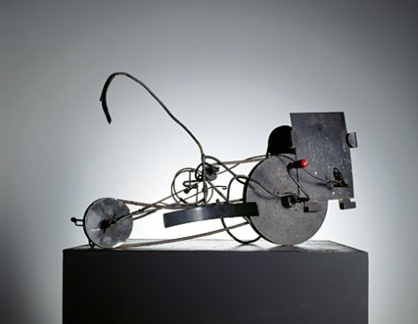
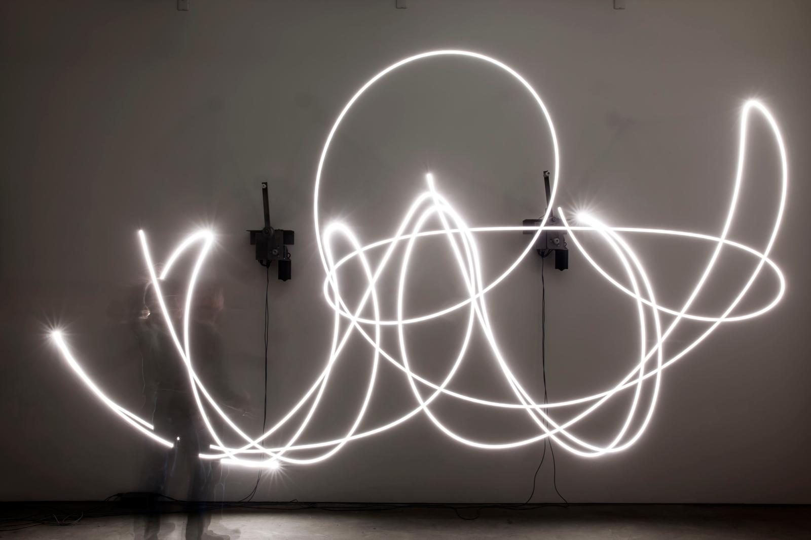
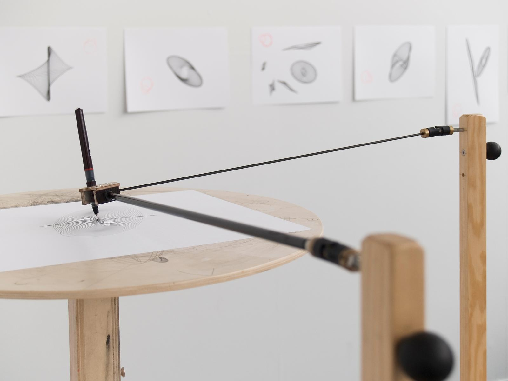
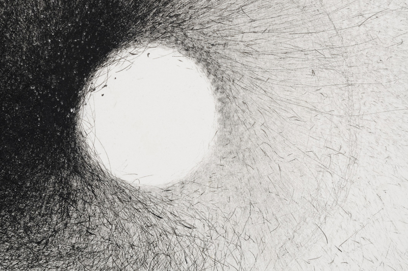
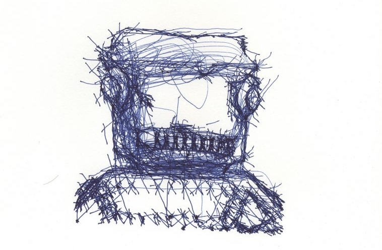
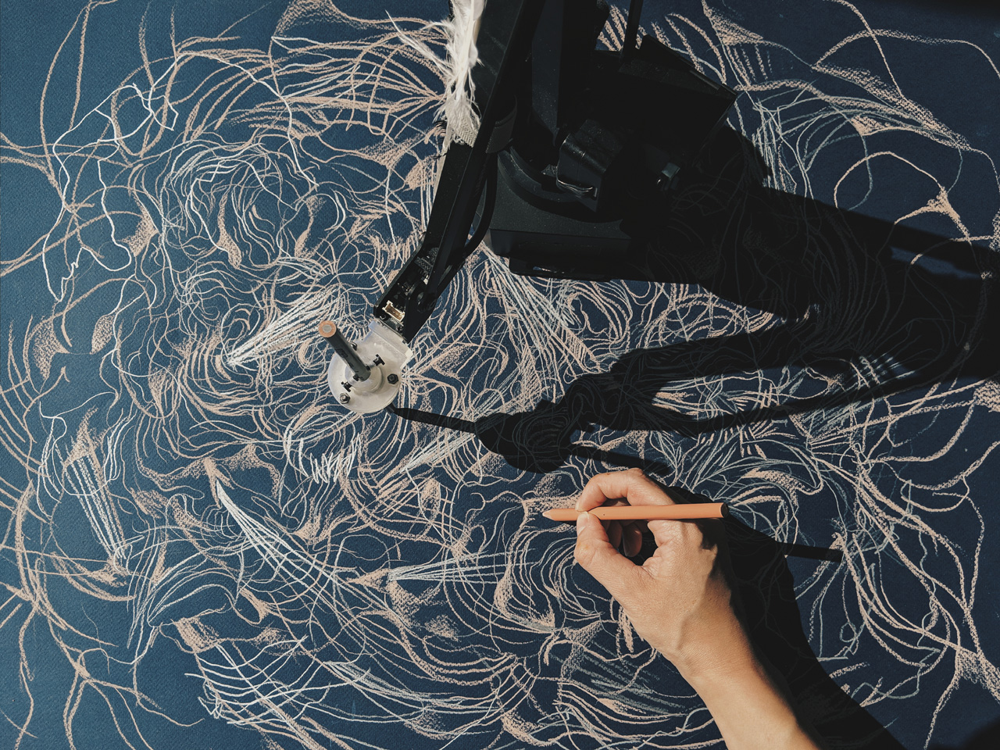
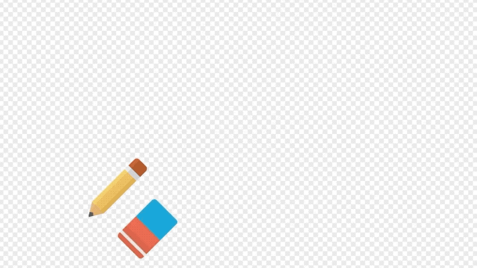
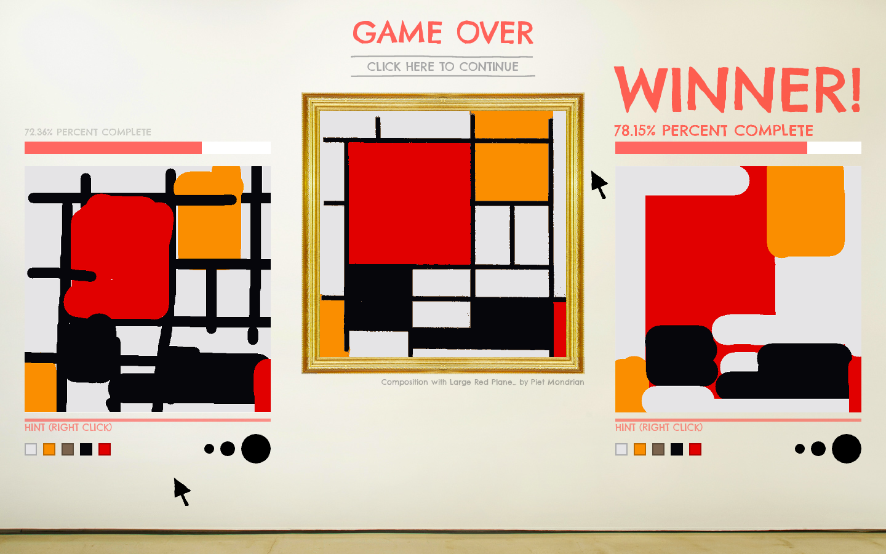

# Session 4: Drawing Machines


_[Jean Tinguely, Méta-Matic drawing machines, 1959](https://www.tinguely.ch/en/tinguely-collection-conservation/tinguely-biographie.html)_

Jean Tinguely's drawing machines complicate a simple question:

> **Who makes the drawing?**

The artist builds the machine.  
A participant may activate it.  
The mechanism determines how it moves.  
Chance and material conditions influence what happens.  
The machine leaves the marks.

The drawing is produced somewhere between **instruction, mechanism, behaviour, participation and accident**. A drawing machine therefore does not simply automate drawing. It changes what drawing can mean.

## Focus

Use code to create **systems that generate, transform or interfere with drawing**.Instead of designing every mark directly, design the behaviour that produces the marks.

## Idea

A drawing machine is a system with its own:

- movement
- rules
- constraints
- inputs
- rhythms
- imperfections
- ways of leaving traces

It can be precise or unstable. It can follow you, resist you, misunderstand you, collaborate with you or ignore you completely. The important shift is:

**drawing an image → designing something that draws**

### Consider:

- What normally counts as drawing?
- Does a drawing require a hand?
- Does a drawing require intention?
- Can movement itself become drawing?
- Can weather draw?
- Can a machine have a recognisable style?
- Can a tool refuse to do what it is told?
- Can a drawing remain unfinished?
- Can a drawing disappear?
- Can several people or systems share authorship?

### Ask:

- What drives the machine?
- What can it sense?
- What does it control?
- What remains outside its control?
- What makes one output different from another?
- What gives the machine character?
- What does the machine do that would be difficult to do directly by hand?
- Is the result more important than the process that produced it?

## Tool, machine or collaborator?

A conventional drawing tool is usually expected to obey.

```text
hand → tool → mark
```

A drawing machine introduces another layer:

```text
human → system → behaviour → mark
```

The relationship can become even less direct:

```text
human
  ↓
environment → machine → behaviour
                     ↓
                  drawing
```

The system now has some influence over the result. This does not mean that the machine is necessarily intelligent or autonomous. It means that **creative decisions have been moved from individual marks into rules and relationships**.

## Designing behaviour instead of appearance

A useful drawing machine can often be described through four components.

### Movement

How does it move?

For example:

- oscillation
- rotation
- pendulum movement
- wandering
- following
- attraction
- repulsion
- acceleration
- random walks
- linked movement

### Input

What affects the movement?

For example:

- mouse position
- keyboard input
- another agent
- time
- sound
- weather
- previous marks
- random values
- physical forces

### Constraint

What limits or shapes the behaviour?

For example:

- boundaries
- maximum speed
- friction
- limited rotation
- distance from another point
- collision
- probability
- memory

### Mark-making

How does behaviour become visible?

For example:

- continuous lines
- points
- repeated shapes
- changing line weight
- changing opacity
- marks produced only under certain conditions
- accumulation
- erasure

The visual result emerges from the relationship between these parts.

## Precision and imperfection

Machines are often associated with:

- precision
- repeatability
- efficiency
- accuracy
- control

A creative machine does not have to value those things.

It might instead be:

- inaccurate
- unstable
- slow
- nervous
- stubborn
- repetitive
- forgetful
- fragile
- unpredictable

Imperfection can become a rule.

Instead of asking:

> How can I make the machine draw correctly?

ask:

> **What kind of mistakes should this machine make?**

## Jean Tinguely: Méta-Matics



_[Jean Tinguely, Méta-Matics, 1959](https://www.tinguely.ch/en/exhibitions/exhibitions/2013/metamatic.html)_

Tinguely developed his **Méta-Matic** drawing machines in 1959. The machines used motors, wheels, belts, rods and pens to produce drawings. Participants could activate them and influence some of their parameters. The machine did not attempt to reproduce the precision normally associated with automation. Instead, vibration, mechanical instability, speed and chance became part of the work. The machine had a kind of character. The resulting drawing was also evidence of an event:

```text
participant
+
machine
+
mechanism
+
chance
+
time
↓
drawing
```

This shifts authorship away from a single hand. The machine is not simply a neutral tool between artist and image. It actively contributes to what becomes possible.

### Think about

- Which decisions belong to the artist?
- Which belong to the participant?
- Which come from the mechanism?
- Where does chance enter?
- Would a perfectly precise version be more interesting?
- Is the machine itself the artwork, or is the drawing the artwork?

## Olafur Eliasson: Your unpredictable sameness



_[Olafur Eliasson, Your unpredictable sameness, 2014](https://olafureliasson.net/artwork/your-unpredictable-sameness-2014/)_

Two mechanical arms perform similar pendulum-like movements. The mechanisms receive comparable inputs, but small physical differences cause their movements to diverge. They are simultaneously:

**the same** and **not the same**

This is an important generative principle. A system can contain identical rules while still producing different outcomes. The difference can come from:

- initial conditions
- momentum
- friction
- material variation
- timing
- interaction between movements

The work asks us to look at the difference between **repeatability and repetition**.



_[Olafur Eliasson - Drawing machines](https://olafureliasson.net/tag/drawing-machines/)_

Eliasson's practice contains many systems where physical processes produce drawings. Pendulums, water, movement, vibration and environmental forces become mark-making mechanisms. The artist does not determine the precise position of every mark. Instead, the artist designs the **conditions under which marks can happen**.

## Cameron Robbins: Wind Drawing Machines



_[Cameron Robbins - Wind Drawings](https://cameronrobbins.com/wind-drawings/)_

Cameron Robbins builds mechanical systems that translate weather into drawings. Wind speed and direction drive the mechanism. Instead of:

```text
artist → mark
```

the relationship becomes:

```text
weather → mechanism → movement → mark
```

The machine operates as an instrument between an environmental force and a drawing. The resulting image is therefore a record of conditions that happened over time. The machine does not illustrate the wind. It **translates its behaviour**.

### Think about

- Is the wind an input, a collaborator or the author?
- What information is preserved by the drawing?
- What information is lost?
- Why use a machine instead of recording wind speed numerically?
- How does the mechanical design affect the translation?

This is also a useful model for working with data:

```text
input → mapping → behaviour → output
```

## Patrick Tresset: drawing as robotic behaviour



_[Patrick Tresset - Human Study #1](https://patricktresset.com/new/project/5-rnp/)_

Patrick Tresset creates robotic systems whose behaviours reference human drawing practices. In _Human Study #1_, robotic drawing agents observe a sitter and produce portraits. The robots contain cameras and mechanical drawing arms, but the interesting part is not simply that a robot can move a pen. Their movements include pauses, observation, repetition and physical imperfections. They appear to perform the role of a drawer. The drawing process therefore becomes part of the work. Instead of hiding the mechanism, the mechanism is staged as a performer.

### Think about

- Why does the robot appear to have personality?
- How much of that personality comes from movement?
- How much comes from our interpretation?
- Would the work feel the same if only the finished drawing were shown?
- What does embodiment contribute?

The robot's limitations also affect its visual style. A machine does not need to imitate the human hand perfectly. Its physical constraints can become its drawing language.

## Sougwen Chung: human and machine collaboration



_[Sougwen Chung - Artefact 1](https://sougwen.com/work/artefact1)_

Sougwen Chung's _Drawing Operations_ projects explore drawing as a collaboration between human and machine. In _Artefact 1_, Chung improvises together with a custom robotic unit connected to a recurrent neural network trained on earlier drawings. The resulting marks come from different sources:

```text
human gesture
+
stored drawing history
+
computational model
+
robotic movement
↓
shared drawing
```

This changes the relationship again. The machine is no longer simply executing a fixed mechanical pattern. It is responding to a body of previous work and participating in an evolving drawing process.

The important question becomes less:

> Who made this mark?

and more:

> **How are decisions distributed across the system?**

This question will become increasingly important later in the course when we work more directly with AI.

## Studio Moniker: Do Not Draw a Penis



_[Studio Moniker - Do Not Draw a Penis](https://studiomoniker.com/projects/do-not-draw-a-penis)_

_Do Not Draw a Penis_ turns drawing into a relationship between instruction, participation and automated moderation. The system asks people not to draw something. Predictably, that prohibition becomes the main reason to draw it. The work then collects those drawings as an appendix to Google's Quick, Draw! dataset. Here the drawing system is not interesting because of how a virtual pen behaves. It is interesting because the **rule changes human behaviour**.

The machine includes:

- interface
- instruction
- participant
- classification
- cultural expectations
- resistance

A drawing machine can therefore be social as well as mechanical.

### Ask

- Can a prohibition become a drawing tool?
- Who controls the behaviour of the system?
- Does the machine draw, or does it cause drawing to happen?
- Can an interface itself act as a behavioural system?

## Sloppy Forgeries: drawing under constraints



_[Sloppy Forgeries - Jonah Warren](https://playfulsystems.com/sloppy-forgeries/)_

_Sloppy Forgeries_ is a competitive drawing game in which two people attempt to reproduce an existing painting as quickly and accurately as possible. The interface creates a particular drawing behaviour through:

- limited time
- limited tools
- competition
- comparison
- measurement

The result is often visually crude, but the interesting part is how the rules influence strategy. A drawing tool is therefore never neutral. Its constraints influence what people do with it.

### Think about

- What behaviours does an interface encourage?
- What does it make easy?
- What does it make difficult?
- What happens when speed becomes more important than precision?
- Can a constraint produce a recognisable drawing style?

## From mechanism to character

A useful way to develop a drawing machine is to imagine that it has a particular character.

For example:

### Precise

```text
input → exact response
```

### Hesitant

```text
input → delay → small response
```

### Nervous

```text
input → response + small continuous variation
```

### Stubborn

```text
input → sometimes ignored
```

### Forgetful

```text
remember only recent positions
```

### Exhausted

```text
movement becomes slower over time
```

### Curious

```text
move toward unfamiliar areas
```

### Social

```text
behaviour depends on other agents
```

The character should come from **rules**, not from a decorative story added afterwards.

For example, instead of saying:

> My machine is nervous.

ask:

> **What computational behaviour would make a machine feel nervous?**

Perhaps it changes direction frequently.  
Perhaps it overshoots its target.  
Perhaps it never completely stops moving. 
 
The character emerges from the system.

## Make a drawing machine

Design a program that expands, augments, distorts, questions, complicates or reinterprets the act of drawing. Your code should behave like a machine with its own rules and character.

It might be:

- a tool
- a collaborator
- a game
- a performer
- an autonomous system
- a critical response to drawing software
- a deliberately bad drawing tool

The goal is not necessarily to make drawing easier.

A good drawing machine might make drawing **stranger**.

### Possible directions

Try one of these provocations:

- Bring a drawing to life.
- Forget about your right or left hand. What else could control the mark?
- Make a machine that requires more than one person.
- Make a single-purpose machine.
- Make a machine that is extremely good at drawing only one thing.
- Create a drawing that cannot be repeated exactly.
- Create a drawing that gradually disappears.
- Make a tool that refuses some instructions.
- Make a tool that misunderstands input.
- Make previous marks influence future marks.
- Make a machine that becomes tired over time.
- Make several drawing agents that interfere with each other.

You can also challenge assumptions such as:

- drawings are made by hand
- drawings are made on flat surfaces
- drawings should be permanent
- drawings should be accurate
- drawings have a clear beginning and end
- a drawing tool should obey
- the person using the tool should remain in control

## A machine needs limitations

Avoid creating a system where everything is random.

Give the machine a clear structure.

For example:

```text
movement rule
+
constraint
+
input
+
variation
+
mark-making rule
```

The limitation is often what gives the machine its identity.

Ask:

- What can this machine do?
- What can it not do?
- What does it always do?
- What does it sometimes do?
- What happens when it fails?

## Use the machine more than once

A generative system is interesting because it can produce a **family of outcomes**.

Do not stop after one image. Use the same machine to produce at least three drawings Compare them.

Ask:

- What remains recognisable?
- What changes?
- Which differences come from the rules?
- Which differences come from input or chance?
- Does the machine have a recognisable visual language?
- Which output reveals the system most clearly?

The aim is not to select the prettiest accident. The aim is to understand the relationship between the **system and its possible outcomes**.

## p5.js starting points

A drawing machine can begin with something extremely simple.

### Lissajous and linked movement

<iframe src="https://preview.p5js.org/guma/embed/gJAZwbKlG" width="100%" height="400" frameborder="0"></iframe>

[_Lissajous in p5.js_](https://editor.p5js.org/guma/sketches/gJAZwbKlG)

Several cyclical movements can combine to produce a complex trace.

Instead of copying the visual result, identify:

- what moves
- what controls the cycles
- which values have different speeds
- where the trace is created

Then change one relationship.

### Lerp and delay

<iframe src="https://preview.p5js.org/guma/embed/E4Qwdkb4Z" width="100%" height="400" frameborder="0"></iframe>

[_Lerp and delay in p5.js_](https://editor.p5js.org/guma/sketches/E4Qwdkb4Z)

A point does not need to follow input immediately.

Delay creates a simple form of behaviour.

```text
input
↓
lag
↓
movement
↓
trace
```

Small changes in responsiveness can produce very different drawing characteristics.

## Generative Design

The **P_2_2** section of _Generative Design / Generative Gestaltung_ contains several useful examples involving agents, wandering paths, connected forms, aggregation, packing and linked pendulums.

These are particularly useful because the final drawing emerges from the behaviour of the system.

- [Generative Design / Generative Gestaltung](http://www.generative-gestaltung.de/)
- [Generative Design p5.js code package](https://github.com/generative-design/Code-Package-p5.js)

When reading the examples, identify:

- the state of the moving element
- how movement is calculated
- what produces variation
- what the system responds to
- where marks accumulate
- which parameters change the character of the machine

## Resources

- [Museum Tinguely - Jean Tinguely and the Méta-Matics](https://www.tinguely.ch/en/tinguely-collection-conservation/tinguely-biographie.html)
- [Studio Olafur Eliasson - Drawing machines](https://olafureliasson.net/tag/drawing-machines/)
- [Cameron Robbins - Wind Drawings](https://cameronrobbins.com/wind-drawings/)
- [Patrick Tresset](https://patricktresset.com/)
- [Sougwen Chung](https://sougwen.com/)
- [Studio Moniker - Do Not Draw a Penis](https://studiomoniker.com/projects/do-not-draw-a-penis)
- [Sloppy Forgeries](https://playfulsystems.com/sloppy-forgeries/)
- [Generative Design](http://www.generative-gestaltung.de/)
- [Lissajous curves](https://en.wikipedia.org/wiki/Lissajous_curve)
- [Coding Challenge - Drawing with Fourier Transform and Epicycles](https://www.youtube.com/watch?v=MY4luNgGfms)
- [3Blue1Brown - But what is the Fourier Transform?](https://www.youtube.com/watch?v=spUNpyF58BY)
- [Coding Challenge - Simple Pendulum Simulation](https://www.youtube.com/watch?v=NBWMtlbbOag)
- [Coding Challenge - Double Pendulum](https://thecodingtrain.com/CodingChallenges/093-double-pendulum.html)
- [A trick to get looping curves with lerp and delay](https://necessarydisorder.wordpress.com/2018/03/31/a-trick-to-get-looping-curves-with-lerp-and-delay/)
- [Data is Nature](https://www.dataisnature.com/)

→ [Back to Session 4](./README.md)  
→ [Examples and references](./examples.md)