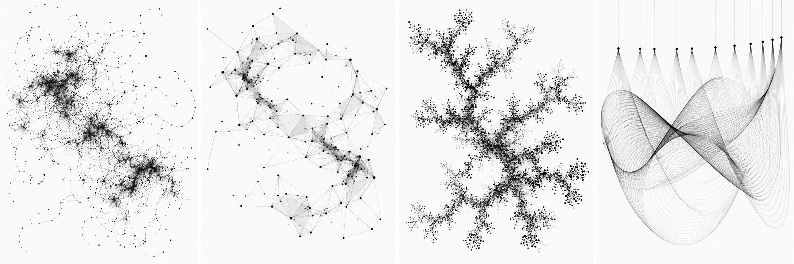
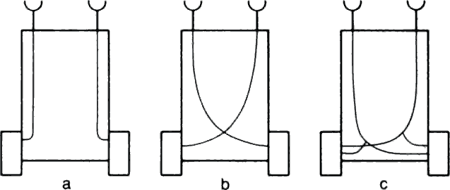
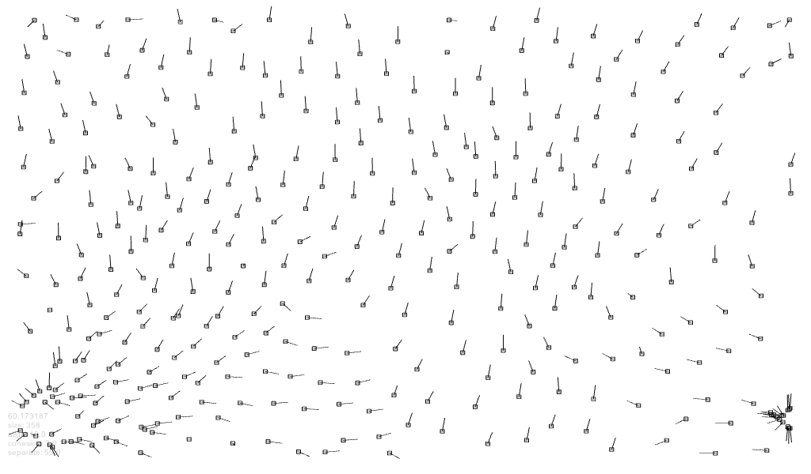
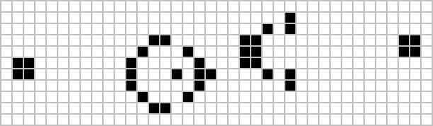
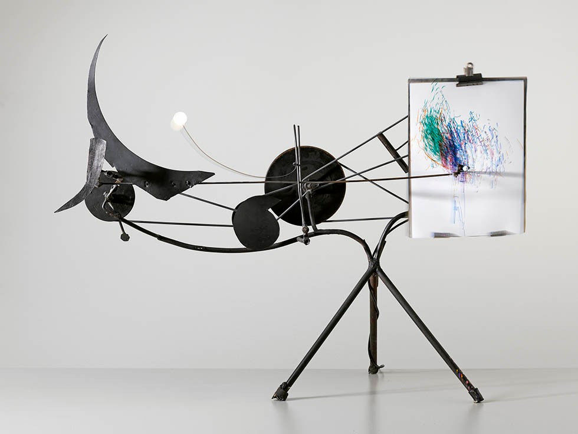

# Session 4: Examples & References

## Behaviour & Agency

A system begins to feel like it has behaviour when its actions depend on its current state, its environment or the actions of other elements.

The rules can be extremely simple.

While looking through these examples, ask:

- What is the smallest behaving element?
- What information does it have?
- What can it sense?
- What causes it to change direction or state?
- Is the behaviour deterministic or probabilistic?
- Does it interact with other elements?
- Does it remember anything?
- Is there feedback?
- What larger behaviour emerges from the local rules?
- When do we begin to describe a system as if it has intention or character?

## Generative Design P_2_2: agents, paths and systems



_Selected P_2_2 examples from Generative Design._

The **P_2_2** section of _Generative Design / Generative Gestaltung_ is one of the most useful practical references for this session.

Instead of concentrating on grids and static variation, these examples introduce elements that **move, respond, accumulate and interact**.

The series progresses through several different ideas.

### P_2_2_1: a simple wandering agent

The first examples describe what the code itself calls a "stupid agent".

The agent has:

- a position
- a step size
- several possible directions
- a rule for choosing the next direction

The resulting drawing is not designed line by line.

It is the history of the agent's movement.

### P_2_2_2: more directed behaviour

The next examples introduce additional logic.

Movement can depend on:

- direction
- boundaries
- angles
- the current position
- previous decisions

The agent still follows relatively simple rules, but its behaviour becomes more structured.

### P_2_2_3: connected agents

Several points change independently but remain connected as one form.

The individual movements are simple, while their relationship produces an evolving larger shape.

This introduces an important idea:

> **An element can have its own behaviour while still belonging to a larger system.**

### P_2_2_4: diffusion aggregation

New elements are placed according to their relationship with elements that already exist.

A global branching structure gradually emerges from many local proximity decisions.

The final form is not drawn in advance.

### P_2_2_5: circle packing

New circles are added wherever space is available without overlapping existing circles.

The system gradually fills the available area.

Here the environment itself changes as the system develops.

Each new circle changes what is possible for the next one.

### P_2_2_6: linked pendulums and traces

Several linked oscillating elements move at related speeds and lengths.

Their movement produces paths over time.

The final image is a trace of the system's behaviour.

### Look for

Across the P_2_2 series, identify:

- position
- direction
- velocity
- current state
- constraints
- boundaries
- randomness
- relationships between elements
- traces
- feedback

Do not only look at the final images.

Open the code and ask:

> **Which rule is responsible for which behaviour?**

### Try this

Choose one P_2_2 example.

Before changing anything, identify:

1. What is the agent or active element?
2. What state does it store?
3. What changes every frame?
4. What conditions affect its behaviour?
5. Where does randomness enter?
6. What produces the visible trace?

Then change **one behavioural relationship** rather than redesigning the whole program.

For example:

> Keep the movement, but change the boundary response.

Or:

> Keep the agent, but change when it leaves a mark.

Or:

> Keep the system, but change what it responds to.

### References

- [Generative Design / Generative Gestaltung](http://www.generative-gestaltung.de/)
- [Generative Design p5.js code package](https://github.com/generative-design/Code-Package-p5.js)
- [P_2_2_1_01 - simple agent](https://github.com/generative-design/Code-Package-p5.js/tree/master/01_P/P_2_2_1_01)
- [P_2_2_2_01 - directed agent](https://github.com/generative-design/Code-Package-p5.js/tree/master/01_P/P_2_2_2_01)
- [P_2_2_3_01 - connected agents](https://github.com/generative-design/Code-Package-p5.js/tree/master/01_P/P_2_2_3_01)
- [P_2_2_4_01 - diffusion aggregation](https://github.com/generative-design/Code-Package-p5.js/tree/master/01_P/P_2_2_4_01)
- [P_2_2_5_01 - circle packing](https://github.com/generative-design/Code-Package-p5.js/tree/master/01_P/P_2_2_5_01)
- [P_2_2_6_01 - linked pendulums](https://github.com/generative-design/Code-Package-p5.js/tree/master/01_P/P_2_2_6_01)

## Braitenberg Vehicles: simple systems, apparent intention



_Valentino Braitenberg, Vehicles: Experiments in Synthetic Psychology._

In _Vehicles_, Valentino Braitenberg imagines a series of extremely simple machines.

A basic vehicle might contain:

- wheels
- motors
- light sensors
- connections between sensors and motors

Changing only the relationship between these components can produce very different behaviours.

A sensor might increase the speed of the motor on the same side.

Or it might control the opposite motor.

The vehicle may then appear to:

- approach a light
- avoid it
- chase it
- hesitate
- become aggressive
- appear curious

The mechanism remains simple.

What changes is how we **interpret its behaviour**.

### Look for

- sensing
- response
- direct connections
- crossed connections
- attraction
- avoidance
- speed differences
- behaviour emerging from simple relationships

### Questions

- How much information does the vehicle actually have?
- Does it know where it is going?
- Does it need an internal model of the environment?
- Why do we begin describing the behaviour with words such as "afraid" or "aggressive"?
- Is apparent intention the same as actual intention?
- How little complexity is required before we perceive agency?

This question will return later when working with AI systems.

### Try this

Imagine an element with two values:

```text
left sensor
right sensor
```

and two possible actions:

```text
turn left
turn right
```

Invent different relationships between sensing and action.

For example:

```text
object close on left → turn right
```

Then reverse the rule.

What kind of behaviour appears?

### References

- [MIT Press - Valentino Braitenberg, Vehicles: Experiments in Synthetic Psychology](https://mitpress.mit.edu/9780262521123/vehicles/)
- [MIT Press - The Open Dynamics of Braitenberg Vehicles](https://mitpress.mit.edu/9780262548199/the-open-dynamics-of-braitenberg-vehicles/)

## Steering and response

A useful way to think about a simple agent is:

```text
state
  ↓
sense
  ↓
decide
  ↓
act
  ↓
new state
```

The element does not need to be intelligent.

It only needs a relationship between its current situation and what happens next.

For example:

### Attraction

```text
target is to the right
↓
turn right
```

### Repulsion

```text
object is close
↓
move away
```

### Boundary response

```text
edge reached
↓
change direction
```

### Following

```text
another element is ahead
↓
move toward it
```

### Wandering

```text
occasionally change direction
```

These behaviours can be combined.

A system can therefore become more complex without introducing a completely new mechanism.

The complexity can come from **several simple rules operating at the same time**.

## Craig Reynolds: Boids



_Craig Reynolds, Boids, 1986._

Craig Reynolds developed the Boids model to simulate coordinated group movement such as flocks of birds and schools of fish.

Instead of programming the path of every individual bird, each boid responds only to nearby neighbours.

The classic model uses three local steering behaviours.

### Separation

Avoid crowding nearby neighbours.

```text
too close → move away
```

### Alignment

Move toward the average heading of nearby neighbours.

```text
neighbours moving this way → turn toward that direction
```

### Cohesion

Move toward the average position of nearby neighbours.

```text
group is over there → move toward group
```

None of these rules describes a flock.

The flock appears when many agents follow the rules simultaneously.

The important relationship is:

**local rules → interactions → global behaviour**

### Look for

- individual agents
- neighbourhoods
- local perception
- steering
- separation
- alignment
- cohesion
- collective movement
- emergent structure

### Questions

- Where is the shape of the flock stored?
- Who controls the group?
- Does any individual boid know the final pattern?
- What happens if one rule is removed?
- How does the number of neighbours affect the system?
- Is the movement still predictable even if every rule is deterministic?

### Try this

Do not begin by implementing the complete Boids algorithm.

Start with one relationship.

For example:

> Several elements move independently. If two become too close, they move apart.

Observe the result.

Then add another rule.

> They also gradually align their direction.

What changes?

The aim is to understand how **several local relationships combine**, not to copy a finished flocking implementation.

### References

- [Craig Reynolds - Boids: Background and Update](https://www.red3d.com/cwr/boids/)
- [Craig Reynolds - Flocks, Herds, and Schools: A Distributed Behavioral Model](https://www.red3d.com/cwr/papers/1987/boids.html)
- [Craig Reynolds - Steering Behaviors](https://www.red3d.com/cwr/steer/)

## Conway's Game of Life: behaviour without moving agents



_Conway's Game of Life._

Conway's Game of Life is a cellular automaton developed by mathematician John Conway in 1970.

The system consists of a grid of cells.

Each cell can be:

```text
alive
```

or:

```text
dead
```

A cell does not move.

Instead, its next state depends on the number of living neighbouring cells.

The standard rules can be summarised as:

- too few neighbours → a living cell dies
- two or three neighbours → a living cell survives
- too many neighbours → a living cell dies
- exactly three neighbours → a dead cell becomes alive

These local rules are applied repeatedly across the whole grid.

From them emerge:

- stable structures
- repeating oscillators
- moving patterns
- growth
- collapse
- highly complex long-term behaviour

### Look for

- discrete states
- neighbourhoods
- local rules
- repeated updating
- patterns that persist
- patterns that oscillate
- patterns that appear to move

### Questions

- Is a cell an agent?
- What information does one cell have?
- Can something appear to move even when no individual cell moves?
- Where does a glider's movement come from?
- How can four simple rules create such a large space of possible outcomes?
- Is the behaviour contained in the rules or in the initial configuration?

### Try this

Imagine a simpler version with only two rules.

For example:

```text
if exactly one neighbour is active → activate
otherwise → deactivate
```

Draw several generations manually on graph paper.

What kind of behaviour appears?

The point is not to reproduce the Game of Life exactly.

The point is to see how **local state changes can produce global dynamics**.

### References

- [LifeWiki - Conway's Game of Life](https://conwaylife.com/wiki/Conway%27s_Game_of_Life)
- [LifeWiki - pattern collection and reference](https://conwaylife.com/wiki/)
- [Wikipedia - Conway's Game of Life](https://en.wikipedia.org/wiki/Conway%27s_Game_of_Life)

## Feedback

A response becomes feedback when the result of an action changes what can happen next.

A simple response might be:

```text
mouse moves
↓
circle follows
```

A feedback loop might be:

```text
agent moves
↓
agent leaves a trail
↓
trail changes the environment
↓
agent senses the trail
↓
agent changes direction
↓
new trail
```

The system is now partly responding to its own history.

Feedback can produce:

- stabilisation
- oscillation
- acceleration
- collapse
- growth
- self-organisation
- unpredictable behaviour

### Positive feedback

A change reinforces itself.

```text
more agents
↓
more attraction
↓
more agents gather
↓
even more attraction
```

### Negative feedback

A change reduces itself.

```text
too dense
↓
agents move apart
↓
density decreases
```

Many interesting systems combine both.

### Questions

- Does the environment change because of the system?
- Does that changed environment affect future behaviour?
- What information survives from one moment to the next?
- Does the feedback stabilise the system or amplify it?

## Jean Tinguely: the machine has character



_Jean Tinguely, Méta-Matic drawing machines, 1959._

Jean Tinguely's **Méta-Matics** were machines that produced drawings.

But their importance is not simply that machines could draw.

Traditional machines are often associated with:

- precision
- repetition
- efficiency
- accuracy
- control

Tinguely's machines introduced:

- vibration
- instability
- chance
- irregularity
- participation
- mechanical imperfection

The machine becomes expressive precisely because it does not behave like a perfect technical instrument.

Tinguely used the term _Méta-Matic_ for machines that could themselves produce artworks.

This complicates the relationship between:

**artist → machine → participant → drawing**

### Look for

- physical constraints
- mechanical wobble
- repetition with variation
- unpredictable traces
- participation
- limited control
- the personality of the mechanism

### Questions

- Who makes the drawing?
- Is the machine a tool, a performer or a collaborator?
- What part of the result is controlled?
- What part comes from material or mechanical variation?
- Would a perfectly accurate version be more interesting?
- Can limitation give a system character?

### Try this

Take a perfectly functional digital drawing tool.

Add one limitation.

For example:

- the cursor follows with a delay
- the line occasionally changes direction
- movement has inertia
- the tool refuses to draw in some areas
- speed changes the line unpredictably
- previous marks influence future movement

Do not add many effects.

Add one behavioural characteristic and see whether the tool begins to feel different.

### References

- [Museum Tinguely - Jean Tinguely biography and Méta-Matics](https://www.tinguely.ch/en/tinguely-collection-conservation/tinguely-biographie.html)
- [Museum Tinguely - METAMATIC Reloaded](https://www.tinguely.ch/en/exhibitions/exhibitions/2013/metamatic.html)

## Behaviour, trace and drawing

Movement can become visible when the system leaves a trace.

```text
rule
↓
behaviour
↓
movement
↓
trace
↓
drawing
```

This produces an important shift.

Instead of designing:

> **What should the drawing look like?**

design:

> **What should the system do?**

The final image becomes evidence of the process that created it.

A trace can record:

- position
- speed
- direction
- collisions
- interactions
- errors
- repetition
- time
- memory

Two runs of the same behavioural system may therefore produce different drawings while still clearly belonging to the same family.

This is the connection to the drawing machine exercise.

→ [Drawing machine references](./drawing-machines.md)

## Five ingredients of behaviour

When building or analysing a behavioural system, it can help to separate five ingredients.

### 1. State

What does the element currently know or remember?

For example:

```text
position
velocity
direction
age
energy
previous state
```

State describes the current condition of the system.

### 2. Perception

What information can affect the element?

For example:

```text
canvas boundary
mouse position
distance to another element
neighbouring cells
existing trail
sound
time
```

Perception does not need to be realistic sensing.

It simply means information available to the rule.

### 3. Rule

How is that information interpreted?

For example:

```text
if distance < 50 → move away
```

or:

```text
if edge reached → reverse velocity
```

The rule connects perception with action.

### 4. Action

What can the element change?

For example:

```text
move
rotate
accelerate
stop
draw
change state
create another element
remove itself
```

### 5. Feedback

How do those actions affect future conditions?

For example:

```text
draw trail
↓
trail changes environment
↓
future movement changes
```

These five ingredients do not need to appear equally in every system.

A very simple behaviour may only use a few.

## From movement to behaviour

It can help to compare several levels of complexity.

### Movement

```text
x = x + 1
```

The value changes.

### Response

```text
if edge reached → reverse direction
```

The change depends on a condition.

### Behaviour

```text
move
↓
sense
↓
respond
↓
update
↓
repeat
```

Several relationships operate over time.

### Collective behaviour

```text
many agents
+
local relationships
↓
emergent global pattern
```

The larger structure is not explicitly drawn.

It emerges from interaction.

## Things to investigate

When you encounter an agent-based, interactive or behavioural system, try to reverse-engineer it.

Ask:

1. What is the smallest behaving element?
2. What state does it store?
3. What can it sense?
4. What rules connect sensing to action?
5. What changes every frame?
6. What is deterministic?
7. What is probabilistic?
8. How does it respond to boundaries?
9. Does it interact with other agents?
10. Does it change its environment?
11. Does the changed environment affect future behaviour?
12. Is there feedback?
13. Does it leave a trace?
14. What global behaviour emerges from the local rules?
15. Would changing one small rule produce a very different system?
16. Why do we describe the behaviour as purposeful, expressive or intelligent?

The goal is not simply to create more complicated movement.

The goal is to understand **how relationships between state, sensing, rules and feedback create behaviour**.

→ [Drawing machine references](./drawing-machines.md)  
→ [Notes on this session](./teacher-notes.md)  
→ [Back to Session 4](./README.md)
