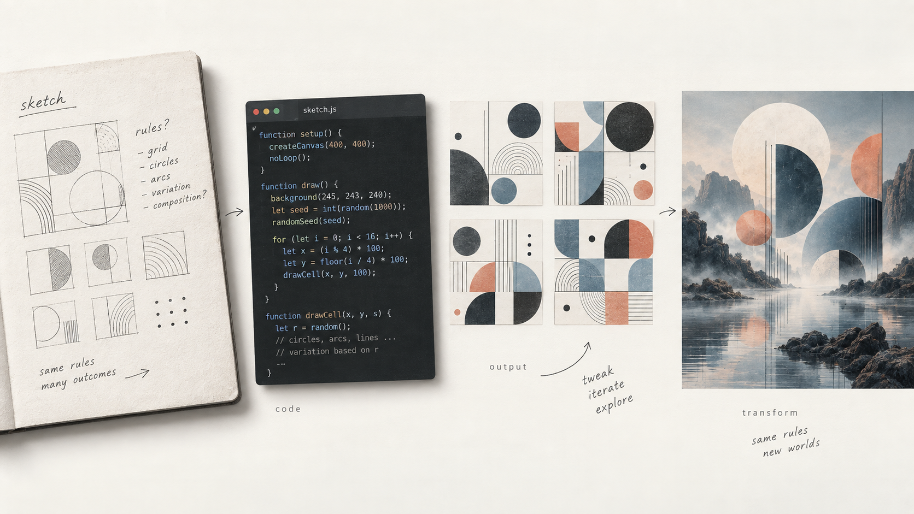

# Generative Coding

Welcome to **Generative Coding** at HSLU Digital Ideation.

In this module we explore how rules, code, randomness, interaction and generative systems can be used as creative material.

We begin by making and executing rules ourselves, then translate those ideas into code with **p5.js**. As the semester progresses, we will work with behaviour, images and data, and eventually connect our own code with generative AI systems for image, sound and video.

The aim is not simply to learn how to make things with code or AI.

The aim is to learn how to **design systems, understand what they do, and make deliberate creative decisions with them.**

## How we work

A recurring process throughout the course will be:

**observe → sketch → formulate rules → build → test → revise**

Later in the semester, AI becomes another part of that process.

We will mainly work with:

- **[p5.js](https://p5js.org/)** for creative coding
- **[VS Code](https://code.visualstudio.com/)** for writing and running code
- **[Git](https://git-scm.com/) and [GitHub](https://github.com/)** for versioning and sharing work
- **[Obsidian](https://obsidian.md/)** for the process journal
- **[Excalidraw](https://github.com/zsviczian/obsidian-excalidraw-plugin)** for sketches, diagrams and visual thinking inside Obsidian
- **[Replicate](https://replicate.com/)** later in the semester for working with generative media models

The course materials and your personal process journal live in separate repositories:

- this repository contains the course overview, lessons, references and presentations
- your personal journal is created from the **[Generative Computer Graphics Journal template](https://github.com/digitalideation/gencg_h2601_journal)**

Open your journal repository in **Obsidian** as a vault and in **VS Code** as a development workspace. This keeps your notes, drawings, code experiments and generated media connected while allowing the journal to be published as a website.

You do not need to learn all of these tools at once. We will introduce them when we need them.

→ **[Tools & Resources](./lessons/extra/resources.md)**

## AI in this course

AI will be introduced progressively.

During the first part of the course, some exercises will deliberately be completed without generative AI. This is not because AI is excluded from creative practice. It is because you first need direct experience of formulating rules, writing code, making mistakes and debugging systems yourself.

Activities will use one of four modes:

### 🔴 HUMAN

Work without generative AI.

### 🟠 EXPLAIN

AI may help you understand a concept, piece of code or error, but should not produce the solution for you.

### 🟡 COLLABORATE

Develop a meaningful first version yourself, then use AI to debug, critique, refactor or extend it.

### 🟢 OPEN

Use AI where it makes sense and document the meaningful decisions and contributions.

Later in the semester we will move beyond using AI simply as a coding assistant.

We will explore AI as **creative material** by transforming images, generating media and connecting different generative systems into pipelines.

## The semester

We have **12 sessions**.

The exact exercises may evolve, but the course follows this general progression:

1. **[Instructions & Systems](./lessons/lesson01_intro/)**
   Rules, procedures, interpretation and human computation.

2. **[Repetition & Variation](./lessons/lesson02_repetition/)**
   Iteration, patterns, controlled randomness and generative variation.

3. **Change Over Time**
   Animation, state, cycles, rhythm and temporal systems.

4. **Behaviour & Agency**
   Autonomous systems, feedback, agents and emergent behaviour.

5. **Parameter Spaces**
   Functions, variables and families of related outcomes.

6. **Images as Data**
   Pixels, sampling, transformation and computational images.

7. **Generative Media**
   Image generation and an introduction to generative sound and video.

8. **Hybrid Pipelines**
   Connecting p5.js, generative models and other media processes.

9. **Final Project: Concept & Prototype**
   Define the system and build an initial proof of concept.

10. **Final Project: Studio**
    Development, testing and iteration.

11. **Final Project: Critique & Revision**
    Share a meaningful draft, receive feedback and revise.

12. **Final Presentation & Critique**
    Present the finished work and its process.

The subject of an exercise is not necessarily the learning objective.  
For example, we might use a clock to investigate **change over time**, a face to investigate **parameter spaces**, or a drawing machine to investigate **behaviour and agency**.  
These are ways of exploring broader computational ideas rather than fixed artistic formats.

## What you will learn

By the end of the module, you should be able to:

- think about creative work as systems of rules and relationships
- translate visual and conceptual ideas into code
- use iteration, randomness, parameters, state and interaction
- develop and debug generative systems
- work with images and data computationally
- connect multiple generative processes into creative pipelines
- use AI critically as both an assistant and a creative medium
- document the development of your work clearly
- explain and defend your creative and technical decisions

## Presentations

We begin the semester with two presentations. First, the **[Introduction](./slides/intro.html)** presents the course, its working methods and what we mean by generative coding. We then move to the **[History](./slides/history.html)** presentation, which looks at artists, designers and computational practices that help situate the ideas we will explore throughout the semester.

## Process journal

Throughout the semester you will maintain a **process journal in Obsidian**. It is a working record of how your ideas, rules and systems develop—not a polished weekly essay.

Each weekly entry should include:

- exploration and experimentation
- influences and references
- algorithmic thinking
- critical reflection

Use sketches, Excalidraw diagrams, screenshots, code experiments, failed attempts, variations, questions and short annotations. Explain meaningful decisions and things you rejected. When AI becomes part of the workflow, briefly document its meaningful contributions and what you did with them; complete prompt histories are not required.

The important thing is to **show your process**, including uncertainty and revision.

→ **[Read the detailed journal guidance](./lessons/extra/journal.md)**  
→ **[Create and set up your journal repository](https://github.com/digitalideation/gencg_h2601_journal)**

## Assessment

### Process & Journal - 40%

Regular experimentation, documentation, sketches, iterations, references and reflection.

### Participation & Engagement - 30%

Attendance, in-class work, discussion, experimentation and constructive peer feedback.

### Final Project - 30%

Concept, system, development, final outcome, documentation and presentation.

## Final project

The final project is an opportunity to develop an independent generative work using the ideas and methods explored during the semester. Possible approaches include:

- a p5.js generative system
- an interactive work
- image or data transformation
- generative imagery
- sound or video
- a hybrid pipeline connecting several systems

AI is **not required**.

A strong computational system built entirely in p5.js is just as valid as a project combining several generative AI models.  What matters is that the tools and systems support the idea, and that you understand the important decisions behind the work.

## Getting started

Before the first session, make sure the basic tools for the course are installed and working. This includes GitHub, Git, VS Code, p5.js support, Live Server, Obsidian and Excalidraw.  

→ **[Prepare your computer for the course](./lessons/extra/setup.md)**

For the first session, bring:

- your laptop
- something to draw with
- curiosity about rules, systems and unexpected outcomes

We begin without AI.

→ **[Session 1: Instructions & Systems](./lessons/lesson01_intro/)**  
→ **[Tools & Resources](./lessons/extra/resources.md)**
